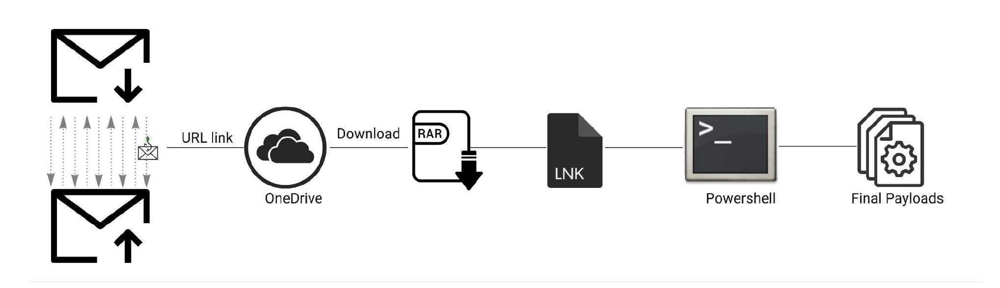
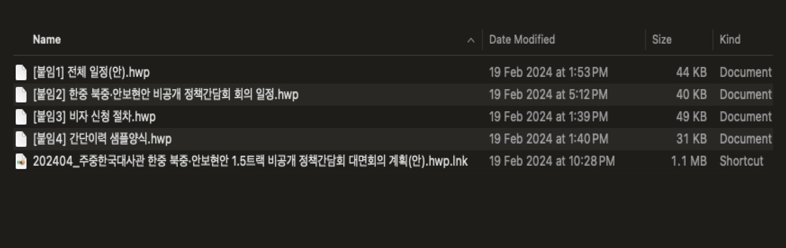
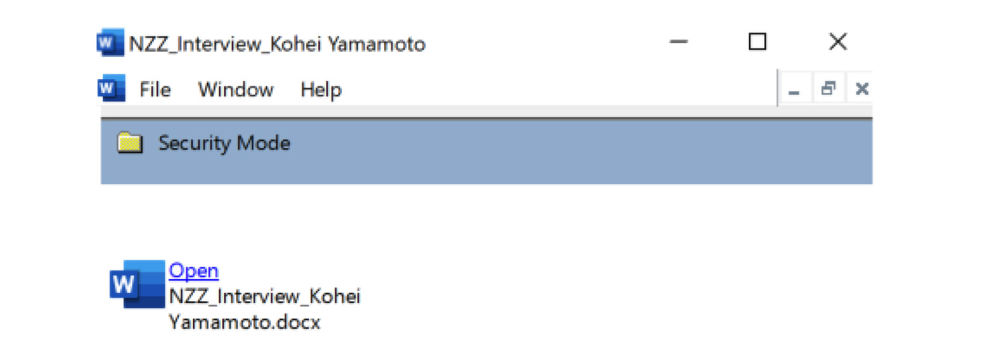

I co-authored this Rapid7 white paper with **Natalie Zargarov** and **Anna Širokova** in 2024. It examines Kimsuky's social engineering and payload tactics. This overview revisits that research; the findings reflect the reporting period.

**[Read the full white paper (PDF, 18 pages)](https://www.rapid7.com/globalassets/_pdfs/whitepaperguide/rapid7-Kimsukys-Phishing-and-Payload-Tactics_wp.pdf).**

## Building trust before delivery

The report describes repeated correspondence before credential phishing or payload delivery, using credible personas and tailored lures.

## Disguised files and execution

One example used a password-protected archive containing a shortcut disguised as a Hangul document. The research also examines LNK toolmarks, CHM files and scripting-based execution.

An MSC sample presented a document lure through Microsoft Management Console.

## Attribution needs context

Shared LNK-builder characteristics alone were insufficient for attribution. The report combines toolmarks with targeting, payloads and infrastructure, and includes further analysis, references and indicator links.

*Figures extracted from the original Rapid7 white paper. Copyright Rapid7, 2024.*
