## **Objective**

This lab is a guided walk-through for running Velociraptor in GUI mode.

GUI mode will be used throughout the workshop.

We also walk through importing additional content into Velociraptor.

The Velociraptor GUI is configured to open automatically upon boot, but the credentials are available below:

- URL: [`https://127.0.0.1:8889/`](https://127.0.0.1:8889/)
- Username: `admin`
- Password: `password`

## **Dependencies**

Windows 10+ VM with administrator level access.

- UEFI enabled for UEFI use cases (detail later)

Internet access if you would like to do content import.

## Tasks



### Download and run Velociraptor in GUI mode

1. Download latest velociraptor release

    0.7.0-3 at time of writing.

    [https://github.com/Velocidex/velociraptor/releases](https://github.com/Velocidex/velociraptor/releases)

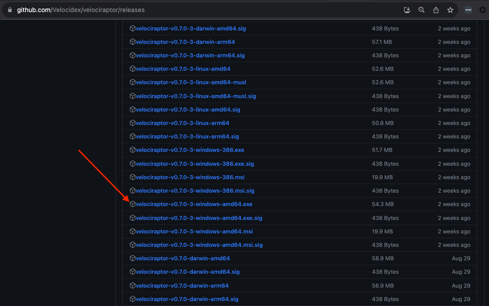

Please copy the downloaded exe to the desktop and rename to velociraptor.exe

2. Open cmd.exe as administrator and cd to your desktop. Run `velociraptor.exe -h` to scope options via help

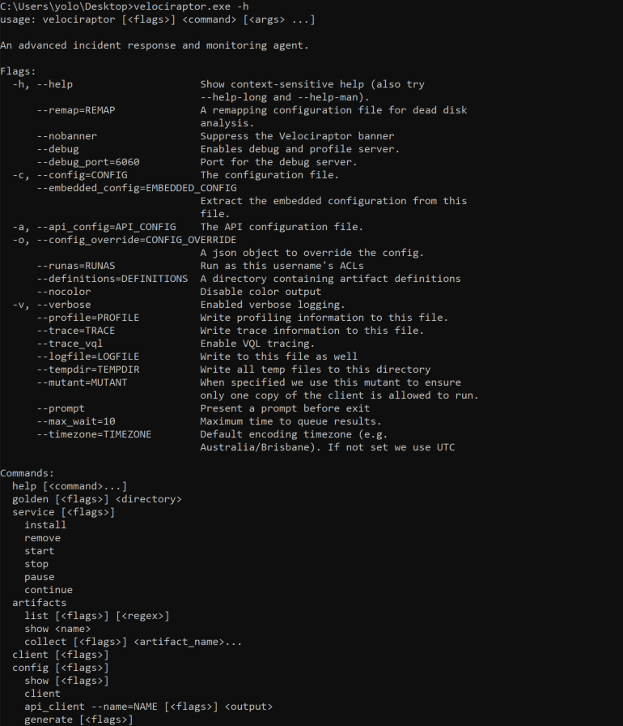

Many velociraptor features are available via the cli and at any level you can view help to understand what switches are available.

As we are running GUI mode run: `velociraptor.exe gui -h`

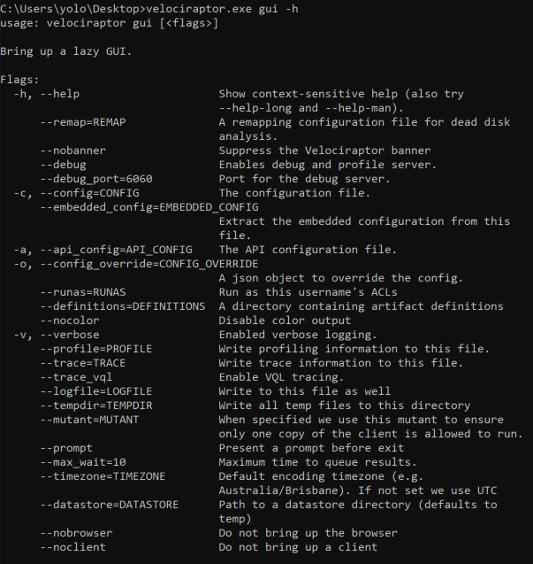

By default Velociraptor will use a datastore in the temp folder. This may not be desired as the OS may purge temp folders and we may loose our work. We can use the datastore switch to specify a path.

3. Create VRdata folder and run Velociraptor

`mkdir VRdata`

`velociraptor.exe gui --datastore=./VRdata -v`

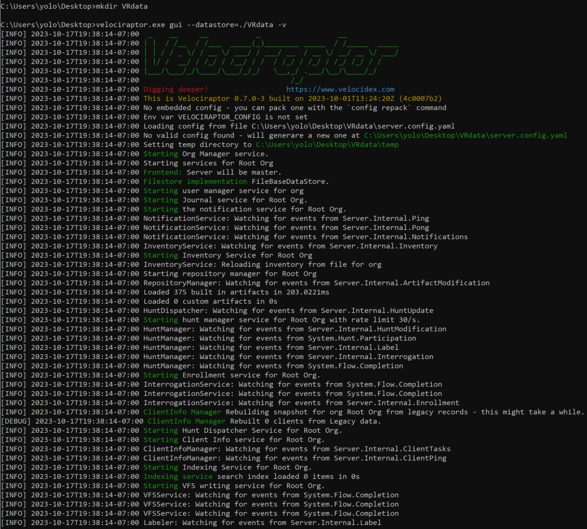

Running -v enables us to review verbose mode in Stdout. Take a moment to scroll up through the output to see what the velociraptor gui mode is doing.

By default a web browser will also load and automatically log into the local velociraptor instance.

NOTE: In windows 11 this feature was not working with Edge only default installs and manual load is required.

Open a browser and goto:

- URL: [`https://127.0.0.1:8889/`](https://127.0.0.1:8889/)
- Username: `admin`
- Password: `password`

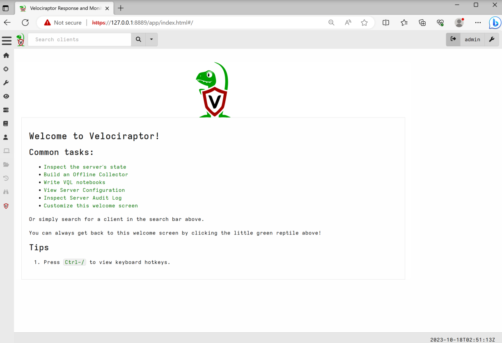

4. Explore GUI and follow demo.

Ensure you familiarise yourself with items important for detection development.

- VFS
- Collection
- Artifacts
- Notebook





### Import additional content

1. Open server collection view and run Server.Import.ArtifactExchange

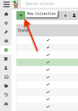

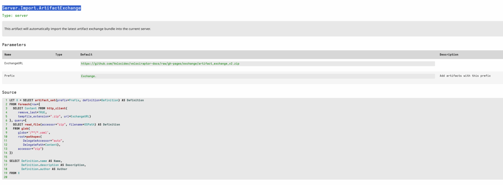

We can configure a prefix to add to each imported artifact, but in this case we will keep as default.

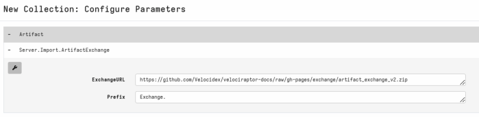

When imported you can see all artifacts have this prefix.

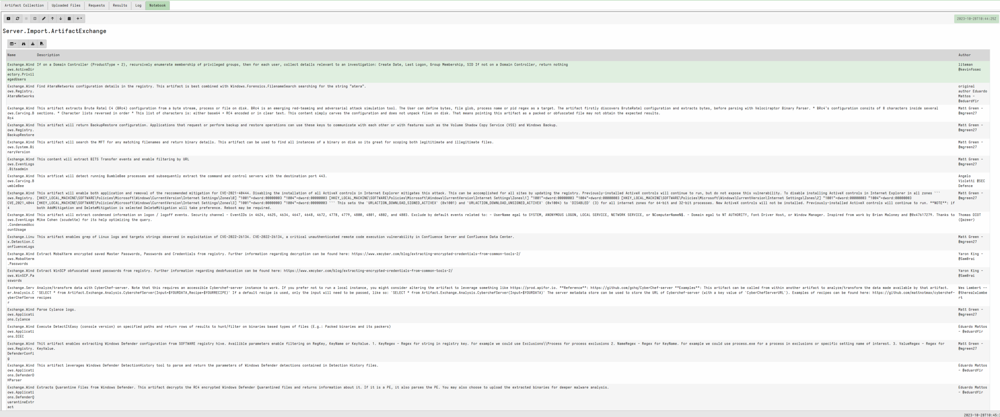

You should now have several Exchange prefixed artifacts in your artifact view.

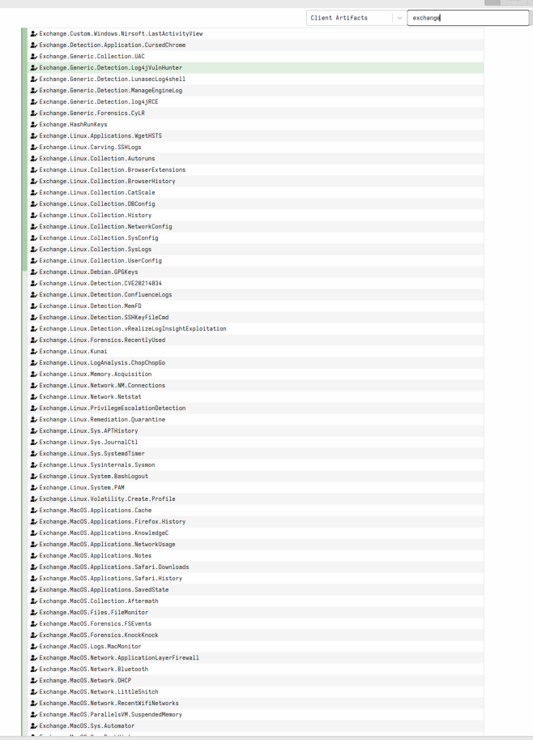

We will use several of these artifacts later 🙂

2. Run the same import process for **Exchange.Server.Import.DetectRaptor**

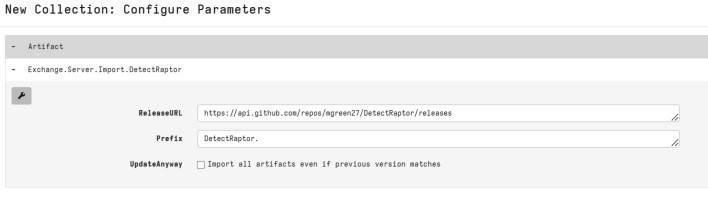

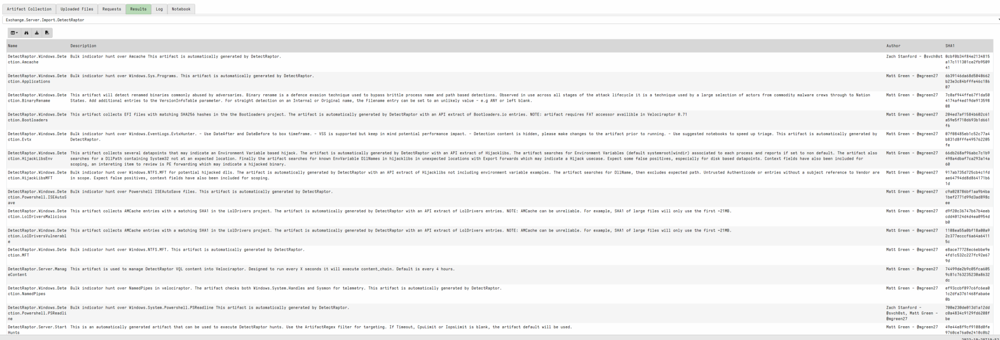


