## **Objective**

Since Microsoft announced that Office applications will block macros from the Internet, adversaries have adapted their initial access techniques. This lab will walk through ****analysis of one of these techniques: LNK files with an embedded decoy document and a payload.

We will run some analysis using Velociraptor, then consider methods to detect at scale.

## **Dependencies**

VM with internet access and Velociraptor available on the desktop to run as per [Lab: GUI mode walk through](/projects/deathcon2023-practical-death-by-velociraptor/gui-mode/)

Open cmd, browse to desktop and run: `velociraptor .exe gui --datastore=./VRdata -v`

The Velociraptor GUI is configured to open automatically upon boot, but the credentials are available below:

- URL: [`https://127.0.0.1:8889/`](https://127.0.0.1:8889/)
- Username: `admin`
- Password: `password`

## Tasks



### Generate Data

1. Run the following Powershell to import a LNK for analysis

```powershell
# DEATHcon 2023: Velociraptor LNK scenario

$ZipUrl = "https://github.com/mgreen27/mgreen27.github.io/raw/master/static/other/DEATHcon/lnk.zip"
$ZipPath = $env:HOMEDRIVE + $env:HOMEPATH + "\Downloads\" + ([uri]$ZipUrl).Segments[-1]
$Lnk1 = $env:TEMP + "\Downloads\현황조사표.xlsx.lnk"
$Lnk2 = $env:TEMP + "\Downloads\가면을쓴북한의실체와숨겨진진실.pdf.lnk"

Add-MpPreference -ExclusionPath $ZipPath,$Lnk1,$Lnk2,$env:TEMP -ExclusionExtension "exe,dll,efi,ps1,zip,lnk,bat,json,csv,xlsx,pdf,json" -ExclusionProcess velociraptor.exe

Invoke-WebRequest -Uri $ZipUrl -OutFile $ZipPath
Expand-Archive $ZipPath -DestinationPath $env:TEMP -Force

Get-ChildItem $ZipPath | Select-Object LastWriteTime,FullName | Format-Table
Get-ChildItem $env:TEMP -Recurse -Filter *.lnk | Select-Object LastWriteTime,FullName | Format-Table
```

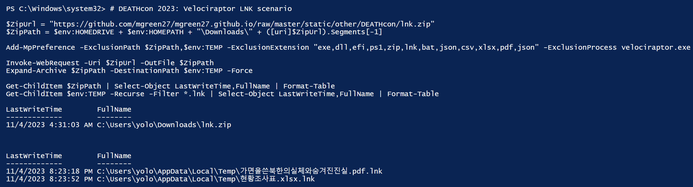

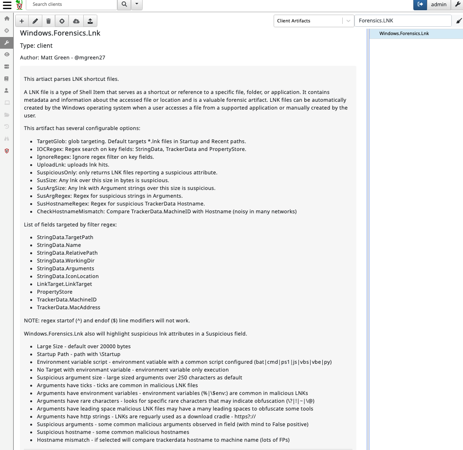

The Powershell will download a zip with two lnk files. It will then extract the lnks to where we would typically expect a payload.

I have only included two files as these are quite large due to embedded decoys inside, this size is what originally caught my attention as a good example to show multiple capabilities of Velociraptor.

2. Open explorer and type %temp% into the search bar to open your users temp folder
3. ⚠️THIS STEP IS RUNNING MALWARE!⚠️

    Take a snapshot and move your VM to host only networking or skip ths step!

    Double click on the samples to generate some powershell payload data

    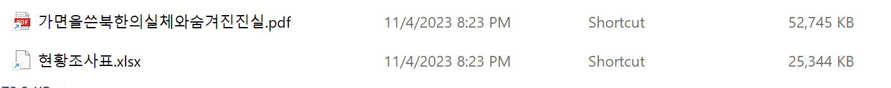


Note icons and double extension.

On my machine I have minimal applications installed (no office) so the office decoy didn't open, but I noticed activity and files dropped.

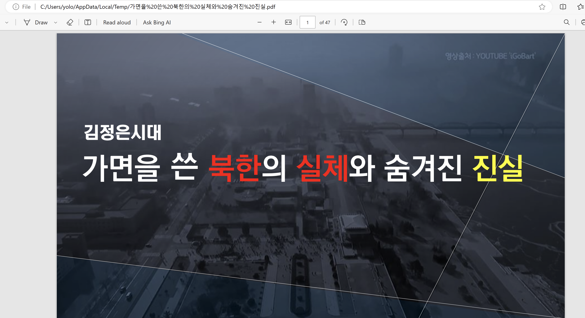

You can google this actor and find further leads for hunting 🇰🇵🇰🇵🇰🇵

Can you determine any lnk builder toolmarks?






### LNK Analysis

1. Since 0.7.0 Velociraptor has an advanced LNK parser. The first step is review the artifact: [Windows.Forensics.Lnk](https://docs.velociraptor.app/artifact_references/pages/windows.forensics.lnk/).

This artifact leverages Velociraptor’s built-in binary parser. Users have the option to search for specific indicators in key fields with regex, or control the definitions for suspicious items to bubble up during parsing.


One of the little known benefits of Velociraptor’s binary parser is speed.

In my own processing of a collection of ~ 17500 lnk files, processing took only 68 seconds!

Due to the process speeds we have capabilities for not only analysis, but as a dynamic hunting tool.

2. The main goal of this lab is to walk through parsing lnk files and decode in Velociraptor. This technique can be used for bulk analysis.

    Open a new notebook notebook and run the following:

    ```sql
    LET TargetGlob = '''C:\{Windows,Users\*\*\AppData\Local}\Temp\**.lnk'''
    SELECT * FROM Artifact.Windows.Forensics.Lnk(TargetGlob=TargetGlob)
    ```

    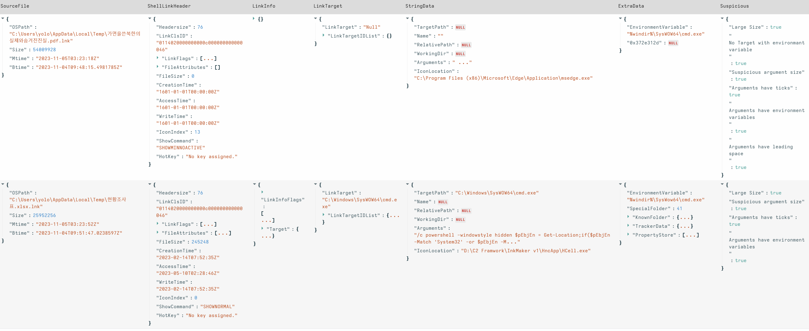

    You can see some of the built-in suspicious flags. Are there any other attributes you recognise as suspicious traits?

    This particular sample has its main payload extraction in the StringData.Arguments field.

3. Add a new cell from the processed cell.

    This gives us the opportunity to use data from a completed cell without reprocessing each refresh. In our example this is not too costly, but when bulk processing or reverse engineering with Velociraptor, this can save valuable seconds each reset.

    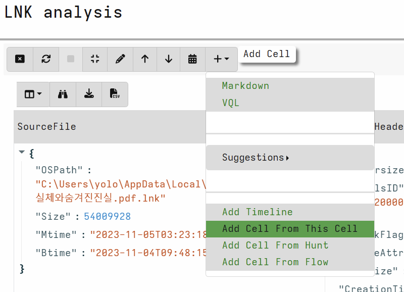

    Use the fields below to scope offsets for extraction:

    ```sql
    SELECT SourceFile.OSPath as lnkpath,
    SourceFile.Size as Size,
    StringData.Arguments as Arguments
    FROM source(
    	notebook_id="N.<CHANGEME>",
    	notebook_cell_id="NC.<CHANGEME>")
    ```

    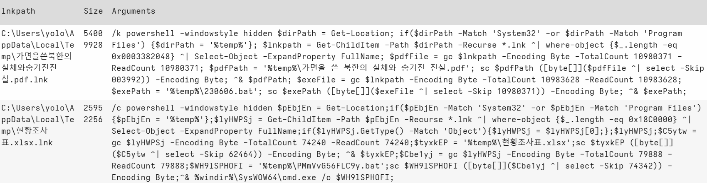

    `gc = Get-Content`

    `sc = Set-Content`

    These scripts are dropping and executing a decoy, then dropping and executing the payload in powershell.

    Can you decode in VQL?

    

    ### **EXPAND FOR SOLUTION!**

    1. For PDF decoy - first round of decode:

        **Remember to change your notebook_id & notebook_cell_id!**

        ```sql
        SELECT SourceFile.OSPath as lnkpath,
        SourceFile.Size as Size,
        StringData.Arguments as Arguments,
        read_file(filename=SourceFile.OSPath,length=10980371)[003992:][:1000] as DecoyPdf,
        read_file(filename=SourceFile.OSPath,length=10983628 )[10980371:] as EncodedPayload
        FROM source(
        	notebook_id="N.<CHANGEME>",
        	notebook_cell_id="NC.<CHANGEME>")
        WHERE lnkpath =~ 'pdf'
        ```

        > 💡 **grpc limitations**
        >
        > You may notice an error if you try to view a really large output in Velociraptor notebook. We are working on the edge of Velociraptor capabilities and there are some GRPC limitations here and its also cumulative over all rows.
        >
        > There are a few ways to tackle this issue:
        >
        > - output partial bytes `DecoyPdf[:1000]` - I used this above
        > - copy the file out for offline analysis `copy(accessor='data',filename=DecoyPdf,dest=DESTINATION)`
        > - add ColumnTypes definition to an upload type in the scope: `upload(file=Decoy,accessor='data',name='DecoyBytes') as Decoy`
        >
        >     Then specify column configuration: `LET ColumnTypes = dict(Decoy='preview_upload')`
        >
        >
        > Later on I switch to just calculating the Magic of the file instead.

        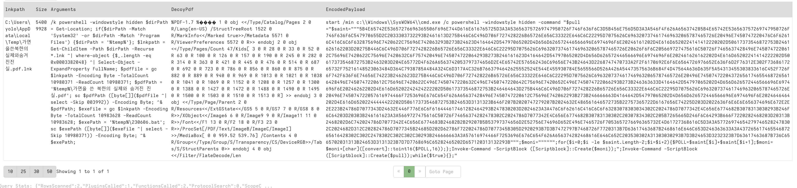

        1. Second round of decode - extract and decode hex payload. Calculate magic of the decoy

            **Remember to change your notebook_id & notebook_cell_id!**


        ```sql
        SELECT SourceFile.OSPath as lnkpath,
            SourceFile.Size as Size,
            StringData.Arguments as Arguments,
            magic(accessor='data',path=read_file(filename=SourceFile.OSPath,length=10980371)[003992:]) as DecoyMagic,
            unhex(string=parse_string_with_regex(string=read_file(filename=SourceFile.OSPath,length=10983628 )[10980371:],regex='''\"\"\"([0-9A-F]+)\"\"\"''').g1) as DecodedPayload
        FROM source(
          notebook_id="N.<CHANGEME>",
          notebook_cell_id="NC.<CHANGEME>")
         WHERE lnkpath =~ 'pdf'
        ```


    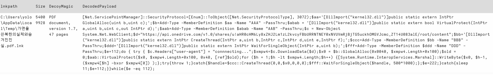

    2. For the second sample we can run a similar method of extraction but a better way is to make the extraction generic so we can process future samples in bulk 😎

        Below I am leveraging a dynamic function named fund_offset to regex the argument field and pull out offsets. We can reuse dynamic functions like built in functions.

        **Remember to change your notebook_id & notebook_cell_id!**


    ```sql
    LET find_offsets(data) = parse_string_with_regex(string=data,
            regex=[
                '-TotalCount (?P<TotalCount>\\d+)',
                '-ReadCount (?P<ReadCount>\\d+)',
                '-Skip (?P<Skip>\\d+)'
            ] )
    
    LET offsets = SELECT SourceFile.OSPath as lnkpath,
            SourceFile.Size as Size,
            StringData.Arguments as Arguments,
            find_offsets(data=split(sep_string='^&',string=StringData.Arguments)[0]) as DecoyOffsets,
            find_offsets(data=split(sep_string='^&',string=StringData.Arguments)[1]) as PayloadOffsets
        FROM source(
          notebook_id="<CHANGEME>",
          notebook_cell_id="<CHANGEME>")
    
    LET data = SELECT lnkpath,Size,
        read_file(filename=lnkpath,length=int(int=DecoyOffsets.TotalCount))[int(int=DecoyOffsets.Skip):] as Decoy,
        unhex(string=parse_string_with_regex(string=read_file(filename=lnkpath,length=int(int=PayloadOffsets.TotalCount) )[int(int=PayloadOffsets.Skip):],regex='''\"\"\"([0-9A-F]+)\"\"\"''').g1) as DecodedPayload
    FROM offsets
    
    SELECT lnkpath,Size,
        magic(accessor='data',path=Decoy) as DecoyMagic,
        DecodedPayload
    FROM data
    ```

    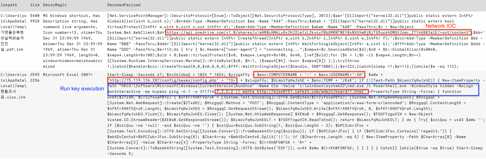

    In addition to run key and network IOCs, network connection, injection and Add-Type together are very suspicious Powershell capabilities!

    An IocRegex covering these may be: `*api\.onedrive\.com|bian0151|cafe24\.com|ping/s+-|Cmshta/s+https?://|::GlobalAlloc|::VirtualProtect|::CreateThread*`

    Interestingly the ping commands appears to wait for a significant time before the mshta execution starts.

    3. As we have a generic extraction of the payload and decoy. Other functions that may be added are:

        `hash(accessor='data',path=Decoy) as DecoyHash`

        `hash(accessor='data',path=DecodedPayload) as PayloadHash`

        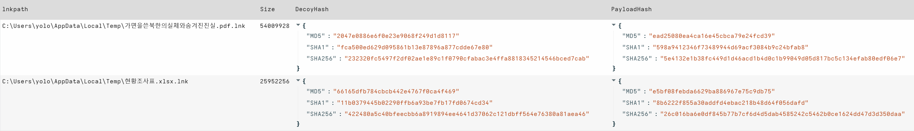

        To assist hunting for dropped files with these hashes in the %temp% folder.


    






### Hunting for IOCs

Using the IocRegex from the last section, there are a several avenues for hunting for IOCs from the information we have:

NOTE: if the malware wasn’t executed - this step will not return results.

1. Run key

    NOTE: I have used a generic glob and IocRegex oppose


```sql
LET IocRegex = '''api\.onedrive\.com|bian0151|cafe24\.com|ping/s+-|Cmshta/s+https?://|::GlobalAlloc|::VirtualProtect|::CreateThread'''
**LET TargetGlob = '''*Software\Microsoft\Windows\CurrentVersion\RunOnce\**'''
*SELECT * FROM Artifact.Windows.Registry.NTUser(KeyGlob=TargetGlob*)
WHERE Data.value =~ IocRegex
```

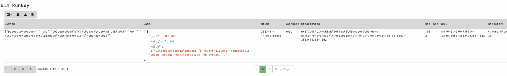

2. Powershell

```sql
LET IocRegex = '''api\.onedrive\.com|bian0151|cafe24\.com|ping/s+-|Cmshta/s+https?://|::GlobalAlloc|::VirtualProtect|::CreateThread'''
LET TargetGlob = '''%SystemRoot%\System32\Winevt\Logs\*Powershell*.evtx'''
SELECT * FROM Artifact.Windows.EventLogs.EvtxHunter(EvtxGlob=TargetGlob,IocRegex=IocRegex)
```

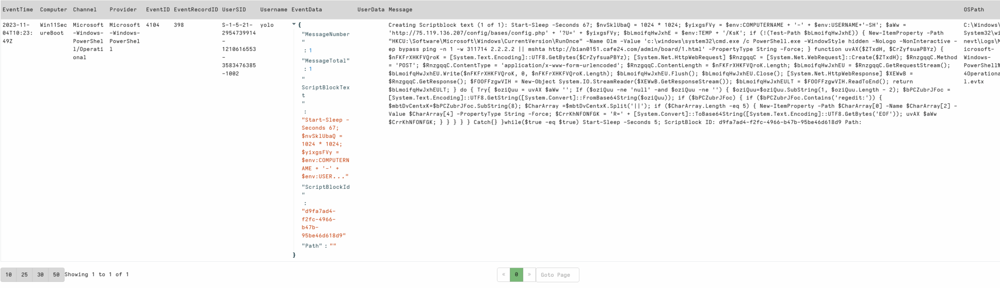

3. We can also run **Windows.Forensics.Lnk** aimed at Temp/User download paths targeting strings of interest or alternatively, one of our yara detection artifacts

    A simple yara rule to detect these LNK files.

    ```lua
    rule SUSP_LNK_InkMaker {
       meta:
          description = "Detects LNK file with InkMaker builder strings"
          author = "Matt Green - @mgreen27"
          date = "2023-11-08"
       strings:
          $s1 = " --TotalCount " ascii wide
          $s2 = " -ReadCount " ascii wide
          $s3 = " -Skip " ascii wide
          $s4 = "[byte[]]" ascii wide
          
       condition:
          uint16(0) == 0x004c and 3 of them
    }
    ```


Threat intelligence tells us this threat is delivered by the LNK inside a zip. This is a great use case for using the zip accessor for this step.

Open your collections view and run **Generic.Detection.Yara.Zip**

`TargetGlob = C:\Users\**\***.zip`

`MaxRecursions = 1`

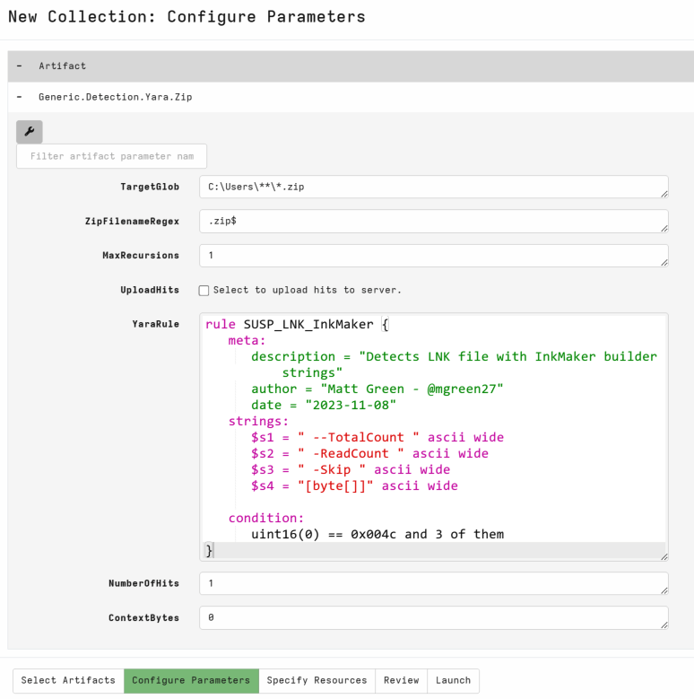

We can clearly see a hit for our zip downloaded as part of the session setup. In a real environment, targeting `C:\Users\**` recursively would ensure we scan any zip files in temporary internet, downloads and other user locations.

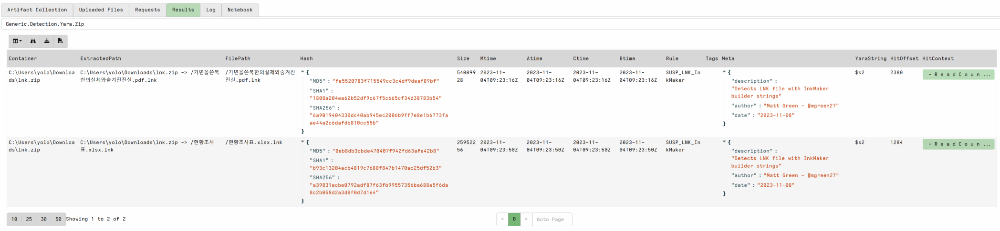



