## **Objective**

This lab is a walkthrough of the patched Terminal Services DLL use case - [T1505.005](https://attack.mitre.org/techniques/T1505/005/). We will firstly replicate the scenario, then walk through how I would build a cross artifact detection using Velociraptor.

## **Dependencies**

VM with internet access and Velociraptor available on the desktop to run as per [Lab: GUI mode walk through](/projects/deathcon2023-practical-death-by-velociraptor/gui-mode/)

Artifact Exchange content has been imported into your Velociraptor instance - [Lab: GUI mode walk through](/projects/deathcon2023-practical-death-by-velociraptor/gui-mode/)

Once patch loaded: Open cmd, browse to desktop and run:

`velociraptor .exe gui –-datastore=./VRdata -v`

The Velociraptor GUI is configured to open automatically upon start, but the credentials are available below:

- URL: [`https://127.0.0.1:8889/`](https://127.0.0.1:8889/)
- Username: `admin`
- Password: `password`

## Tasks

### Unpatched RDP demonstration

1. Run the following commands to create a users to test the scenario from an elevated command prompt:

```powershell
net user adminuser password /add
net localgroup Administrators adminuser /add
```

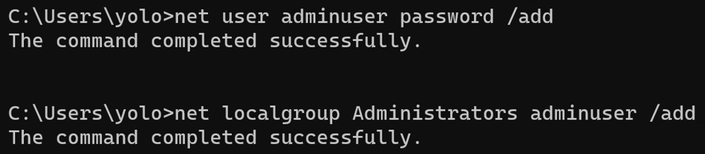

1. Next RDP into your VM host using your original user to create an initial session.
2. Make a second RDP session into your VM host using the `adminuser` account and note the notifications for each user.

    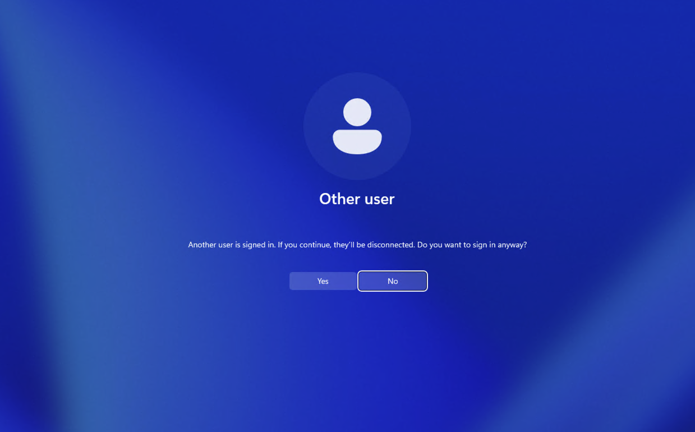

    New adminuser RDP session view

    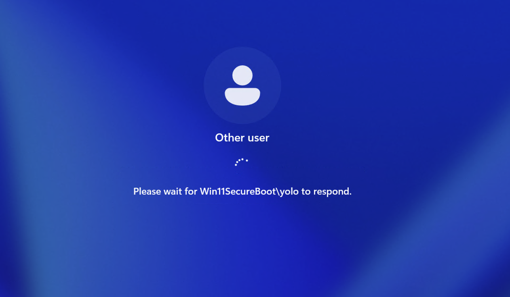

    New adminuser RDP session view - selecting Yes

    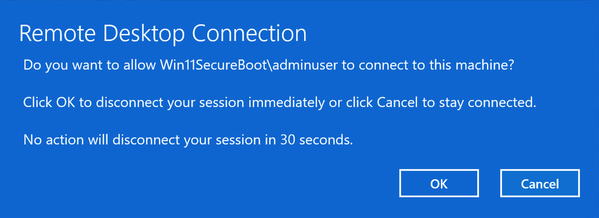

    Notification on original Terminal Services session

    1. `quser` can be used to confirm only one session is active.

    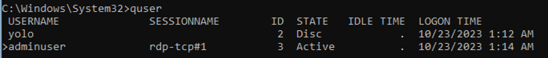


### Install patch and validate successful

1. Open Powershell console as Administrator and run the following frfom the VMWare local console (not an RDP session).

    The commands below will download a script to patch RDP which entails restarting RDP so local console (RDP less) execution is required.


```powershell
Set-ExecutionPolicy -ExecutionPolicy Unrestricted

$uri = 'https://gist.githubusercontent.com/mgreen27/518f7af0b2b1abce1c8e75978548d7c0/raw/20b9d805ce533af6d2cf193941381612530f9c90/Patch-RDP.ps1'
$rdp_function = $env:HOMEDRIVE + $env:HOMEPATH + '\' + ([uri] $uri).Segments[-1]
Invoke-WebRequest -Uri $uri -OutFile $rdp_function
. $rdp_function
Patch-RDP
```

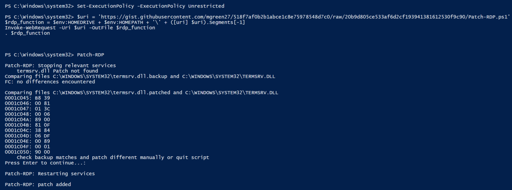

Take a look at the patch script located at: [patch-rdp.ps1](https://gist.github.com/mgreen27/518f7af0b2b1abce1c8e75978548d7c0#file-patch-rdp-ps1)

You can see it is searching for a byte pattern: `39 81 3C 06 00 00 0F 84 ?? ?? 0? 00`   (? as a wildcard)

And replacing with: `B8 00 01 00 00 89 81 38 06 00 00 90`

You can rollback the patch by running: `Patch-RDP -remove`

1. Next, RDP into your VM host using your original user to create an initial session.
2. Make a second RDP session into your VM host using the `adminuser` account and note the notifications for each user.

    Note: no errors or notifications to the logged on user.

3. Run `quser` from an elevated cmd.exe to confirm we have 2 successful sessions.

    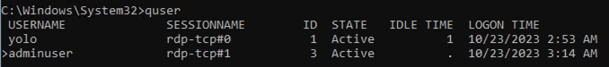


Observing 2 concurrent sessions indicates the patch is working as expected!

### Search for patched termsrv.dll

**Windows.System.VAD** is an artifact that enables enumeration of process memory sections via the Virtual Address Descriptor (VAD). The VAD is used by the Windows memory manager to describe allocated process memory ranges. Availible filters include process, mapping path, memory permissions or by content with yara.

As we are searching for a specific patch, we can target yara looking for the specific hex bytes of the patch and target by process and mapping for performance.

`$patch = { B8 00 01 00 00 89 81 38 06 00 00 90 }`

1. In a new notebook run a query using **Windows.System.VAD** targeting relevant mapped sections and yara using the above.

```sql
LET YaraRule = '''rule termserv_modified {
    meta:
        description = "Finds hex of termsrv.dll patch"
   strings:
     $patch = { B8 00 01 00 00 89 81 38 06 00 00 90 }
    condition:
      $patch
}'''

LET ColumnTypes = dict(HitContext='preview_upload')
SELECT * FROM Artifact.Windows.System.VAD(
                ProcessRegex='svchost\.exe',
                MappingNameRegex='termsrv\.dll$',
                SuspiciousContent=YaraRule )
```

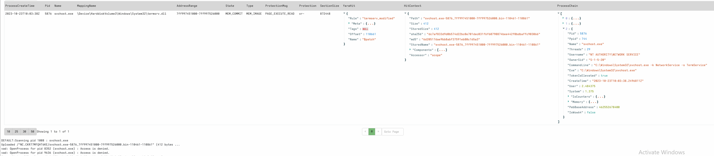

> 💡 Notices at the bottom of output can be ignored.
>
> Windows.System.VAD uploads hit and context bytes to take advantage of Velociraptor’s hex view.
>
> `LET ColumnTypes = dict(HitContext='preview_upload')` can be added to show Velociraptor’s preview view.

We have now developed a targeted detection for in memory patched termserv.dll!

> 💡 You can modify the mapping regex to change what file is targeted. For example `MappingNameRegex='\.dll$'` would target all mapped dlls instead of a specific name. For an unmapped section we can target `MappingNameRegex='^$'`

1. In a new notebook run a query using **Windows.Detection.Yara.NTFS** targeting patched termserv.dll to find the file on disk.

```sql
LET YaraRule = '''rule termserv_modified {
    meta:
        description = "Finds hex of termsrv.dll"
    strings:
     $patch = { B8 00 01 00 00 89 81 38 06 00 00 90 }
    condition:
      $patch
}'''

LET ColumnTypes = dict(HitContext='preview_upload')
SELECT * FROM Artifact.Windows.Detection.Yara.NTFS(
                FileNameRegex="^termsrv\.dll$",
                PathRegex=".",
                YaraRule=YaraRule )
```

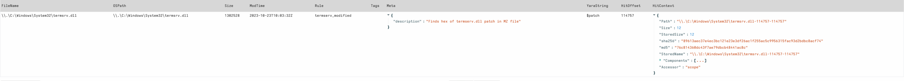

In the example above, we are interested in the unique file name and using yara.NTFS for best performance. Using this method I have found unexpected staging locations and filtering the MFT for filename is low impact.

> 💡 Get in the habbit of checking artifacts when using notebook to develop detections.
>
> **Windows.Detection.Yara.NTFS** has a hardcoded path so we often need to specify `PathRegex = “.”`

### ServiceDLL replacement

1. With the patch applied, run the following commands at an elevated Powershell console:

```powershell
Copy-Item C:\Windows\System32\termsrv.dll C:\Windows\Temp\termsrv.dll -force
reg add "HKLM\SYSTEM\CurrentControlSet\Services\TermService\Parameters" /v ServiceDll /t REG_EXPAND_SZ /d "C:\Windows\Temp\termsrv.dll" /f
```

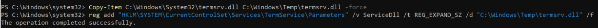

> 💡 **Windows.System.Services** is an artifact that returns all Windows services details. We can use this artifact to check ServiceDll and automatically calculate hash and Authenticode metadata.

1. Search for a modified TermService service dll

In this case we are best suited to run `Windows.System.Services`

```sql
SELECT * FROM Artifact.Windows.System.Services(
                DisplayNameRegex='Remote Desktop Services',
                Calculate_hashes='Y',
                CertificateInfo='Y')
WHERE Name =~ 'TermService'
    AND ( NOT ServiceDll = 'C:\\Windows\\System32\\termsrv.dll'
        OR CertinfoServiceDll.Trusted = 'untrusted' )
```

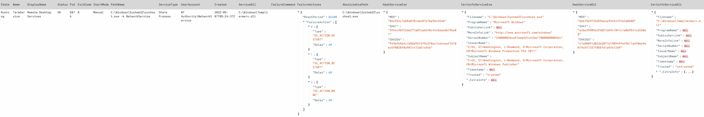

We have now enabled detection of a ServiceDLL replacement for this service!

Could you write a generic ServiceDLL replacement for other Windows services?

### Putting it all together

After developing several detection use cases for this scenario we might want to create a an artifact.

> 💡 The main caveat converting notebook queries is escaping. Pay attention to any parameters that may require escaping and ensure to test your artifact!

1. Open the artifact view and add a new artifact.

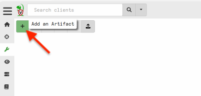

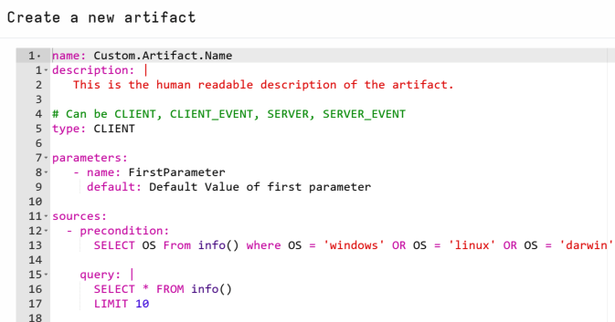

1. Use the built in template to build a single grouped artifact or multiple artifacts.

You can either deploy one for each use case or attempt an all in one like my example below.

Velociraptor has the concept of scope allowing several queries under different scope names. This can be helpful for developing tactical groupings of artifacts.

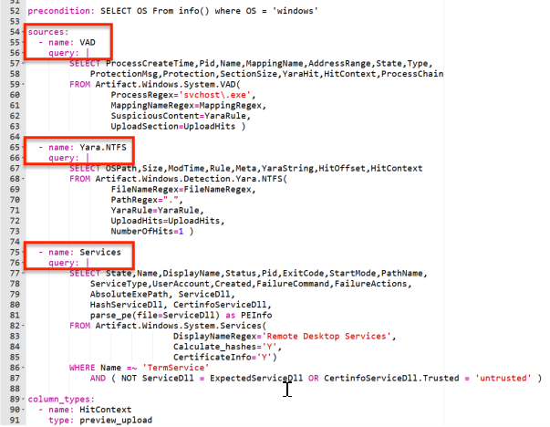

View the completed [Windows.Detection.Termsrv](https://docs.velociraptor.app/exchange/artifacts/pages/termsrv/) on the imported artifact exchange content to see the complete example and run against your lab VM.

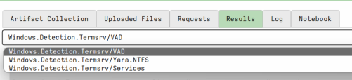

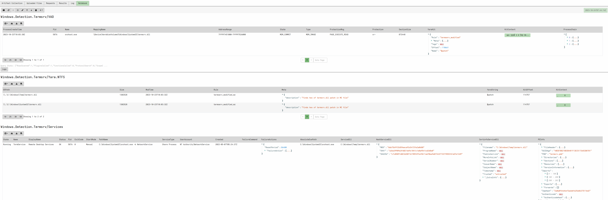

👈 To go back, tap the link at the top left, or swipe from left to right across your screen.
