## **Objective**

This lab is a walkthrough of Velociraptor UEFI visibility and simulation on how we would deploy capability to detect BlackLotus from a technical detection article.

1. Generic Velociraptor visibility from the Windows EFI API.
2. Install BlackLotus malware sample.
3. We will walk through several detection capabilities for BlackLotus style attacks that can be used at scale via Velociraptor.

## **Dependencies**

VM with UEFI installed. I have also added a task below to walk through this process.

VM with internet access and Velociraptor available on the desktop to run as per [Lab: GUI mode walk through](/projects/deathcon2023-practical-death-by-velociraptor/gui-mode/).

Artifact Exchange content has been imported into your Velociraptor instance - [Lab: GUI mode walk through](/projects/deathcon2023-practical-death-by-velociraptor/gui-mode/)

Take a snapshot of your VM to enable rollback : We are going to run malware and its much easier to simply roll back at the end of the lab.

Open cmd, browse to desktop and run: `velociraptor .exe gui -–datastore=./VRdata -v`

The Velociraptor GUI is configured to open automatically upon start, but the credentials are available below:

- URL: [`https://127.0.0.1:8889/`](https://127.0.0.1:8889/)
- Username: `admin`
- Password: `password`

## Tasks

### Enabling UEFI on your Virtual Machine

Probably the most confusing task for users when unfamiliar with UEFI is how to setup their virtualisation environment to support UEFI.

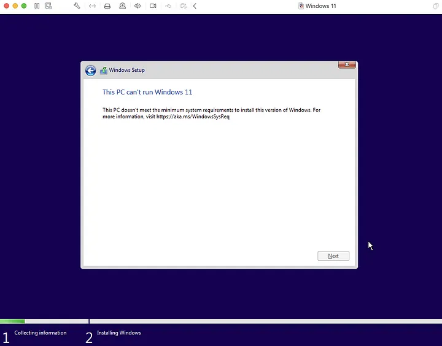

Your pain after running through windows install and not having UEFI enabled!

For Windows machines I have included a link in my references: [How to enable TPM and Secure Boot on VMware to install Windows 11](https://pureinfotech.com/enable-tpm-secure-boot-vmware-install-windows-11/)

Essentially we need to configure the following additions:

- UEFI firmware
- Trusted Platform Module (TPM) chip
- Encryption enabled

A configuration on MacOS VMFusion for a fresh Windows 11 install is as follows:

1. Enabled UEFI firmware type and Virtual Based Security - VBS

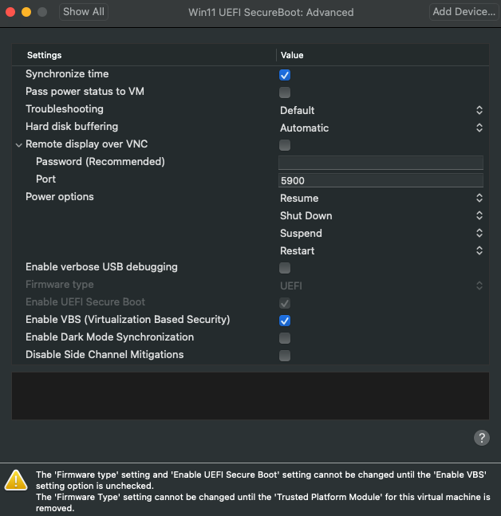

1. Install a Trusted Platform Module (TPM) chip

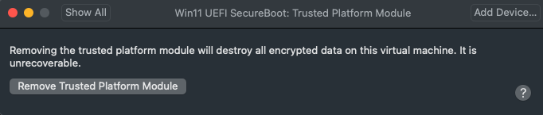

1. Enable Encryption

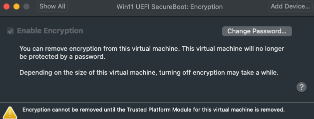

1. Processors and Memory should be enabled and greyed out

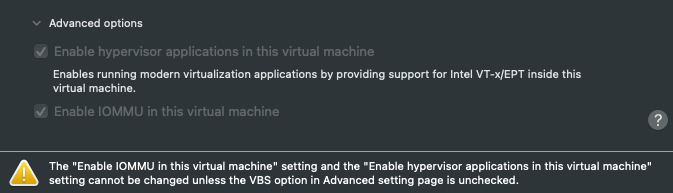

Please take a snapshot after install of Windows.

UEFI secure boot may cause blue screens if there is an issue during the boot process. I have found after installing BlackLotus a rare occurrence of a BlueScreen during the boot process (after successful testing).I was able to boot after this successfully, so try to reboot and see if it resolves your issue.

### Walk through EFI API visibility

Thank you to the community! Velociraptor has a cross platform (Windows + Linux) EFI plugin and function to query a system’s EFI variables.

> 💡 **Velociraptor EFI visibility**
>
> efivariables() plugin: for extracting EFI variables from Linux and Windows.
>
> Generic.System.EfiSignatures: artifact to parse EFI signature information from efivariables

1. Open a new notebook and run the efivariables() plugin

```sql
SELECT * FROM efivariables()
```

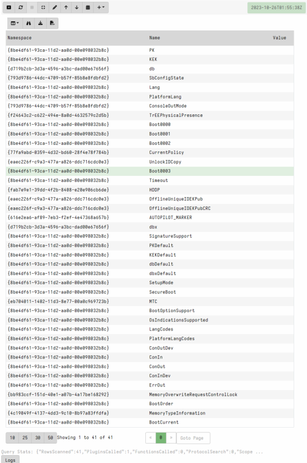

You can see the variable name and namespace listed but no values. Using the ? in notebook we can see the arguments for this plugin and to view values we need to run the plugin with the argument: `efivariables( value=’Y’)`

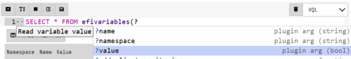

1. Rerun the query with `efivariables( value=’Y’)`

    Review the efi variables available on your machine. Note some entries are text, others binary.


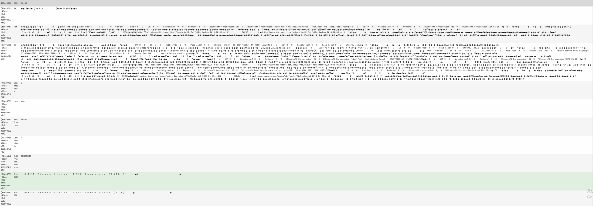

I encourage you to read this description on UEFI variable keys [James Bottomley  - The Meaning of all the UEFI Keys](https://blog.hansenpartnership.com/the-meaning-of-all-the-uefi-keys/)

1. Open the Velociraptor artifact view and search for Generic.System.EfiSignatures

    Review the VQL:

    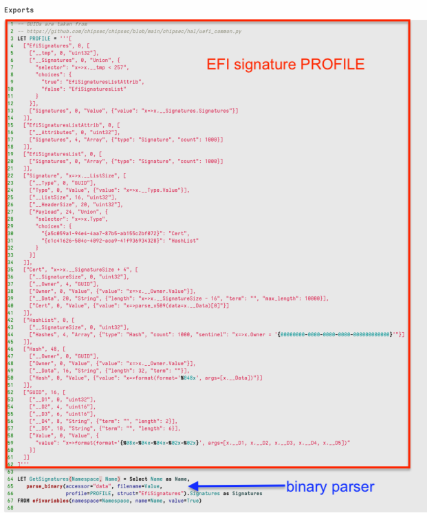

    This artifact has an exportable EFI profile and dynamic function that calls the efivariables plugin and uses the Velociraptor binary parser to extract  EFI signature information.

    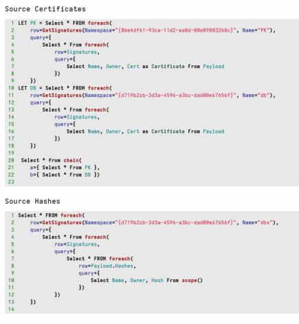

    The Certificates scope focuses on the Platform Key (PK) and Signature Database (db) variable names.

    The Hashes scope focuses on the Revoked Signatures Database (dbx)


1. Run Generic.System.EfiSignatures either in a collection view or in your previous notebook

    ```sql
    SELECT * FROM Artifact.Generic.System.EfiSignatures()
    ```


As you can see in the results and from the previous description these datapoints are excellent for data stacking.

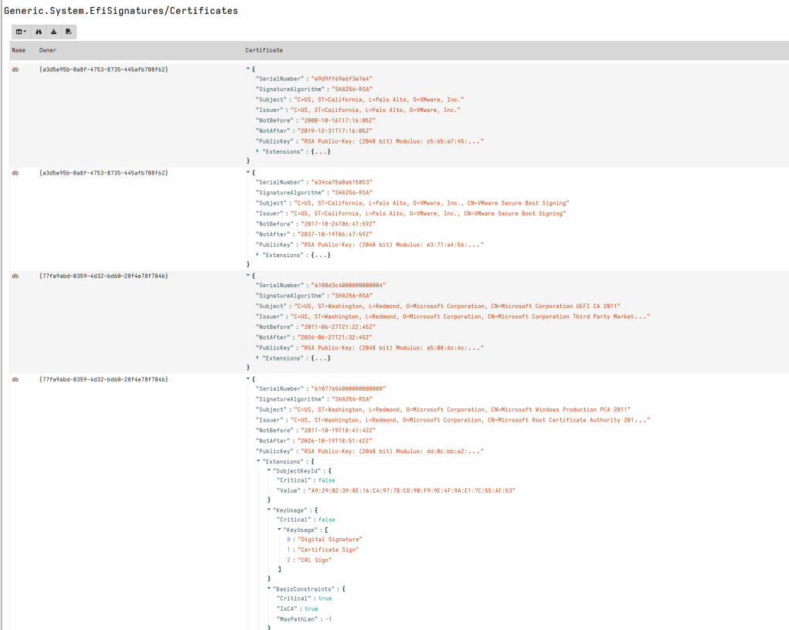

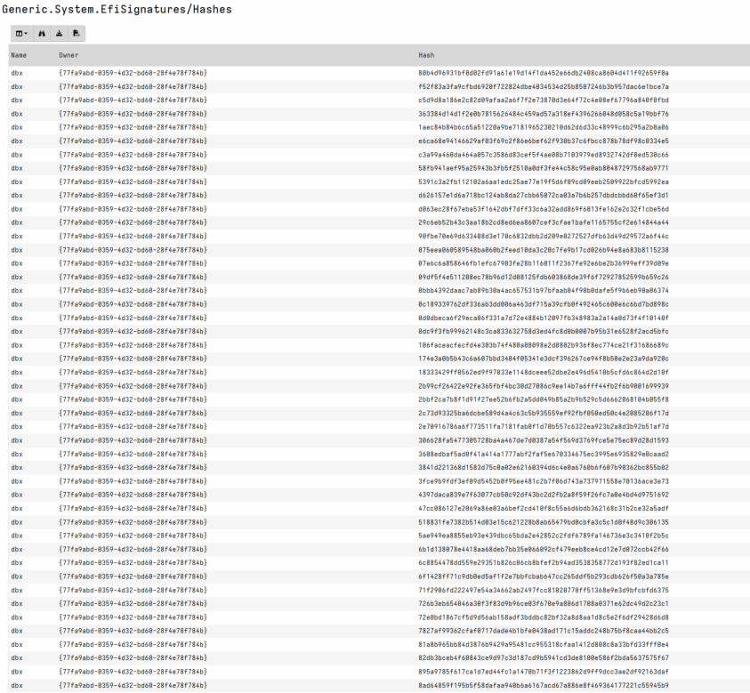

### Install BlackLotus

1. Browse to my DEATHcon staging gist: [blacklotus_demo.ps1](https://gist.githubusercontent.com/mgreen27/518f7af0b2b1abce1c8e75978548d7c0/raw/27a77bcbbe4246065c4b3e3d31ee48f3779fa3a8/blacklotus_demo.ps1)

    Copy this Powershell into a privileged Powershell_ISE window (it embeds the binary and is much too large to share in this page).

    The Powershell will set a payload variable, disable Defender then drop the BlackLotus payload to disk, then execute it.


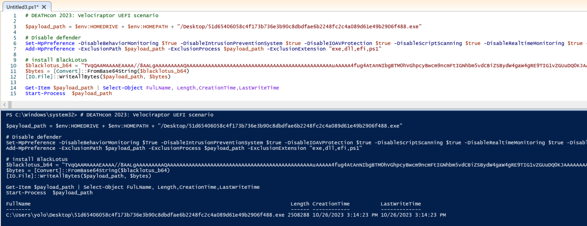

After running the above, please reboot your machine so we can generate a BlackLotus boot event in TCGLogs.

One of the interesting features of BlackLotus is that it removes token privileges from Defender (MsMpEng.exe) with SE_PRIVILEGE_REMOVED. Once rebooted, you can also try to run the Defender configuration from the previous step once more and you should get errors.\

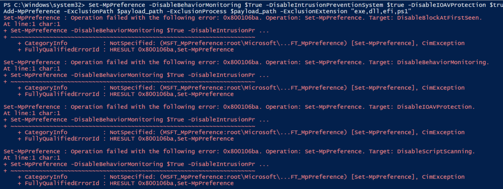

Note: This may not work all the time as the implementation is buggy if Defender process restarts but it is a good indicator if your BlackLotus deployment is successful.

### Query the EFI System Partition (ESP)

1. First open the reference Microsoft article: [Guidance for investigating attacks using CVE-2022-21894: The BlackLotus campaign](https://www.microsoft.com/en-us/security/blog/2023/04/11/guidance-for-investigating-attacks-using-cve-2022-21894-the-blacklotus-campaign/)

    Review the section on **Recently created and locked bootloader files**

    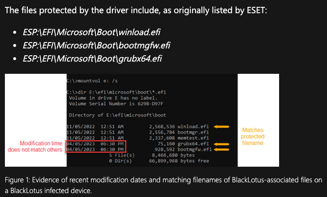

    The EFI System Partition is typically a small FAT format partitioned drive we can discover using the raw_file accessor and parsing the PartitionTable.

    **Exchange.Windows.Forensics.UEFI** is an artifact that enumerates any ESP that exists on disk. It allows parsing of the ESP File Allocation Table to run forensics use cases on an ESP.

    1. Review **Exchange.Windows.Forensics.UEFI**

    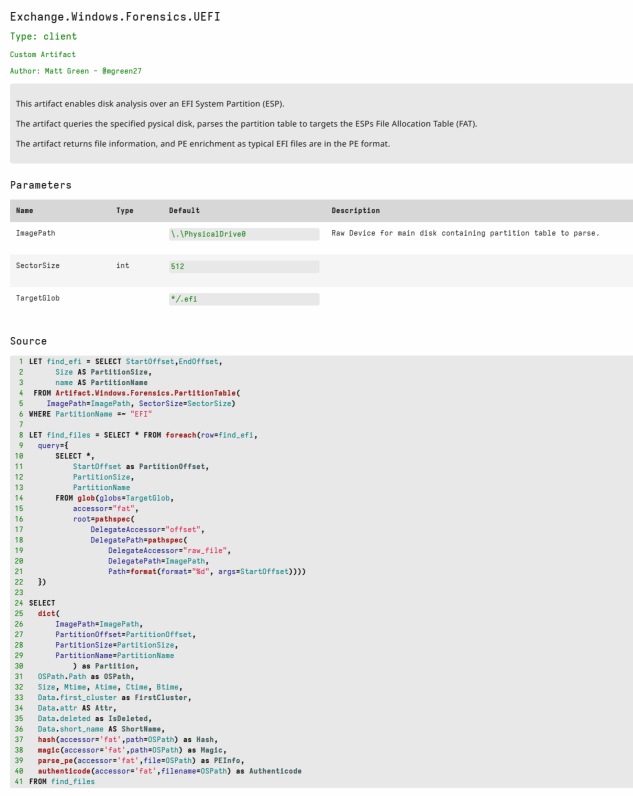

    The default glob which returns all `**/*.efi` files on the partition.

    1. Open collection view and run **Exchange.Windows.Forensics.UEFI.**

        We want to target `\efi\microsoft\boot\*.efi`


    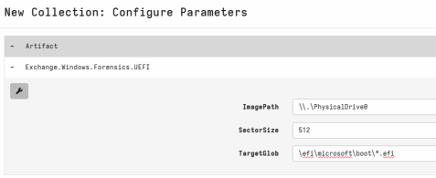

    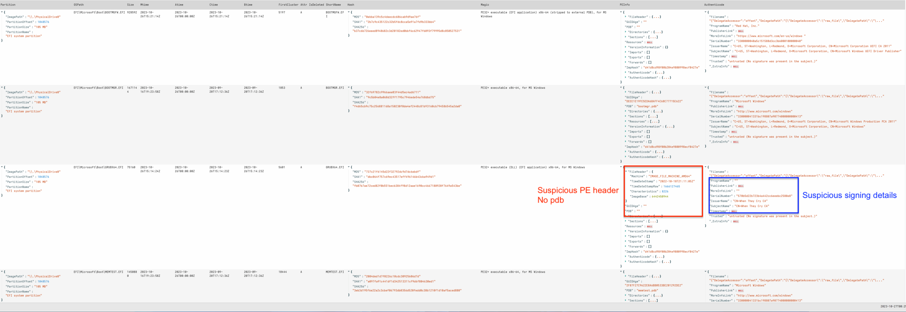

    I have included authenticode data in this artifact, mainly for signing details. Due to the way secureboot implements trust we can ignore the Authenticode.Trusted field for this artifact. We can however, spot other Certificate or PE abnormalities.

    1. Change the results notebook to target fields of interest

    ```sql
    SELECT OSPath, Size, Mtime,Btime,Attr,IsDeleted,ShortName,Hash.SHA256
    FROM source(artifact="Exchange.Windows.Forensics.UEFI")
    ```

    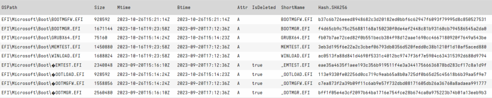

    It should also be easy to spot both the timestamps on malicious files and deleted original EFI files.

    1. Next open the reference Microsoft article: [Guidance for investigating attacks using CVE-2022-21894: The BlackLotus campaign](https://www.microsoft.com/en-us/security/blog/2023/04/11/guidance-for-investigating-attacks-using-cve-2022-21894-the-blacklotus-campaign/)

        Review the section on **BlackLotus staging directory presence**

        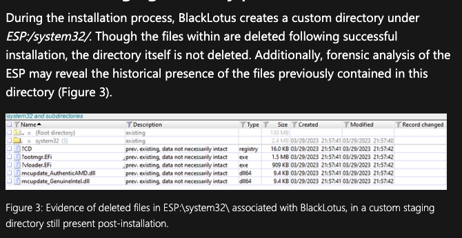

        Using the same fields as previous in the notebook results Here we can clearly see the BlackLotus deleted files which line up to the publicly available BatonDrop - CVE-2022-21894.


    Rerun the collection from last step and use the path: `system32/**`

    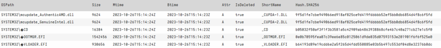

    NOTE: As all files are deleted, the hash values may be incorrect.

    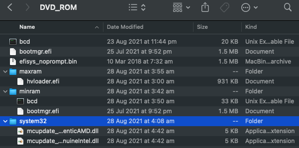

    Publicly available BattonDrop iso contents on Github


### Yara EFI System Partition (ESP)

As Velociraptor has the ability to query the ESP via the fat accessor, we can also add a yara hunt easily.

1. Open collection view and run a new collection with the artifact the artifact: **Exchange.Windows.Detection.Yara.UEFI** this is currently in the artifact exchange but will be added to the main repository in future.

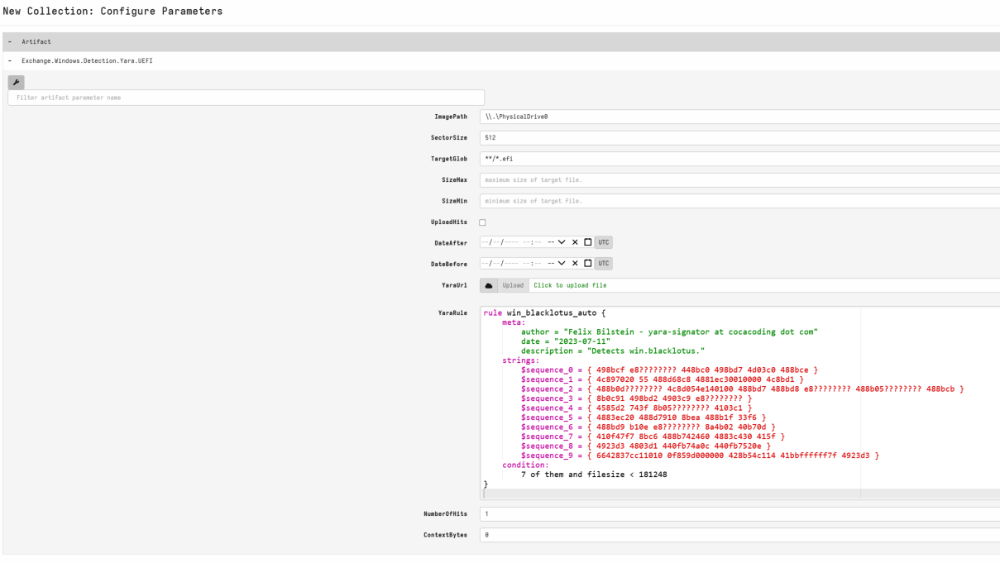

As you can see the default rule for this artifact is the BlackLotus rule available on Malpedia

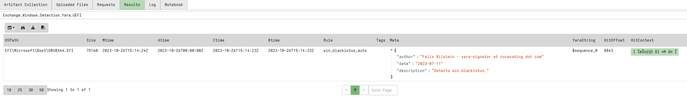

### MeasuredBoot logs

1. Open the reference Microsoft article: [Guidance for investigating attacks using CVE-2022-21894: The BlackLotus campaign](https://www.microsoft.com/en-us/security/blog/2023/04/11/guidance-for-investigating-attacks-using-cve-2022-21894-the-blacklotus-campaign/)

    Review the section on **Boot configuration log analysis:**

    Trusted Computing Group (TCG) logs, also known as *MeasuredBoot* logs, are Windows Boot Configuration Logs that contain information about the [Windows OS boot process](https://learn.microsoft.com/en-us/windows/security/information-protection/tpm/how-windows-uses-the-tpm). To retrieve these logs, the device must be running at least Windows 8 and have the Trusted Platform Module (TPM) enabled.

    From [How Windows uses the Trusted Platform Module](https://learn.microsoft.com/en-us/windows/security/information-protection/tpm/how-windows-uses-the-tpm): “Windows 8 introduced Measured Boot as a way for the operating system to record the chain of measurements of software components and configuration information in the TPM through the initialization of the Windows operating system.” “For software, Measured Boot records measurements of the Windows kernel, Early-Launch Anti-Malware drivers, and boot drivers in the TPM.”

    The BlackLotus bootkit has boot drivers that are loaded in the boot cycle. *MeasuredBoot* logs list the BlackLotus components as *EV_EFI_Boot_Services_Application*.

    Measured boot logs are stored at *C:\Windows\Logs\MeasuredBoot\*.log and*

    We can also extract the latest log from memory using Tbsi_Get_TCG_Log_Ex Windows API.

    In **Windows.Forensics.UEFI.BootApplication** I have implemented parsing these locations leveraging the Velociraptor inventory capability to manage execution of Matt Graeber’s [TCGLogTools](https://github.com/mattifestation/TCGLogTools).

2. Run **Exchange.Windows.Forensics.UEFI.BootApplication** imported from the artifact Exchange.

    Available options are a glob to target local log files and AllParsedTCGLog, an option to select returning all TCGLogs for triage.

    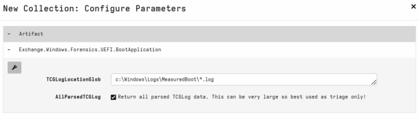

    Default output it is fairly easy to spot the non default BootApplication entries that match the Microsoft article.

    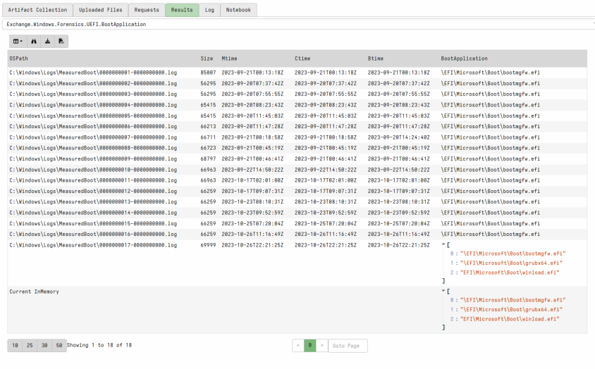

    With AllParsedTCGLog option we can also view individual BootApplication events manually.

    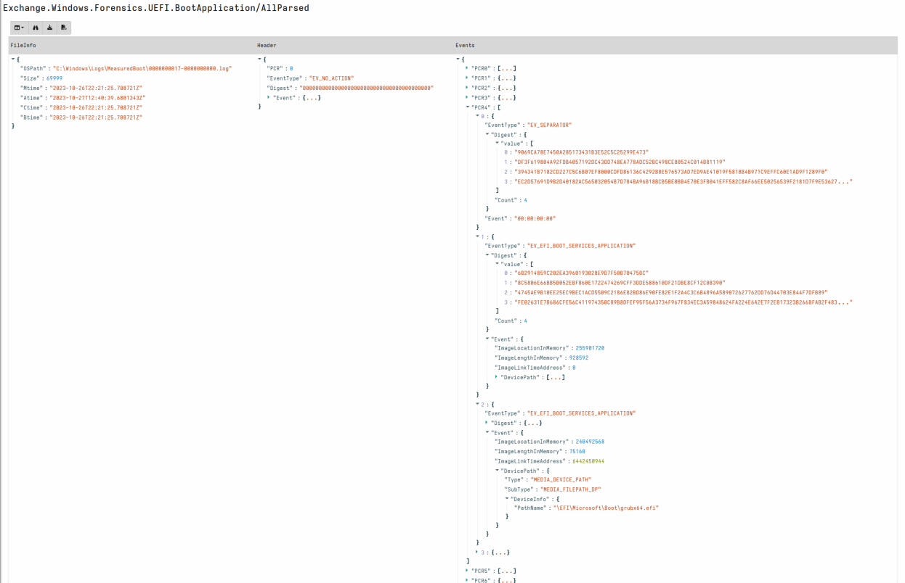


> 💡 Hunting opportunity
>
> The BootApplication field from **Windows.Forensics.UEFI.BootApplication** is an interesting datapoint to hunt for!
>
> You will find lots of vendors that have EFI hooks in the wild.
>
> When hunting: I do not recommend selecting AllParsedTCGLog unless you are running a small machine size triage as the size of the AllParsed collection may be high across thousands of machines.

### HVCI registry

[From Microsoft](https://learn.microsoft.com/en-us/windows/security/hardware-security/enable-virtualization-based-protection-of-code-integrity): “**Memory integrity** (HVCI) is a virtualization-based security (VBS) feature available in Windows. Memory integrity and VBS improve the threat model of Windows and provide stronger protections against malware trying to exploit the Windows kernel. VBS uses the Windows hypervisor to create an isolated virtual environment that becomes the root of trust of the OS that assumes the kernel can be compromised. Memory integrity is a critical component that protects and hardens Windows by running kernel mode code integrity within the isolated virtual environment of VBS. Memory integrity also restricts kernel memory allocations that could be used to compromise the system.”

1. Open the reference Microsoft article: [Guidance for investigating attacks using CVE-2022-21894: The BlackLotus campaign](https://www.microsoft.com/en-us/security/blog/2023/04/11/guidance-for-investigating-attacks-using-cve-2022-21894-the-blacklotus-campaign/)

    Review the section on **Registry modification:**


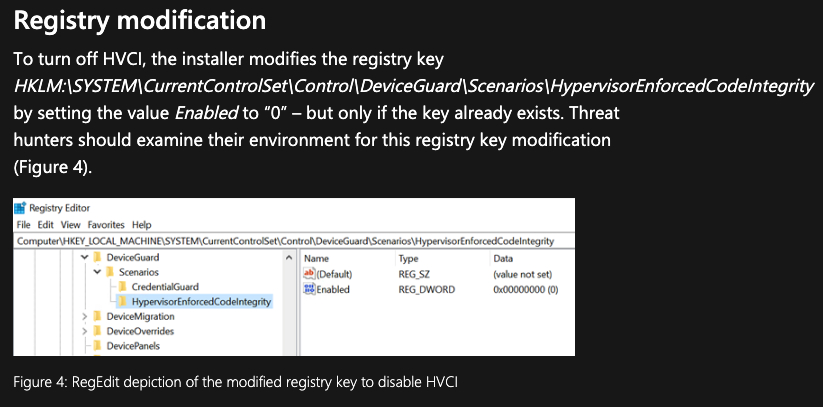

1. In a default VM install I did not have this feature installed, so we want to generate data for this testing.

    From an elevated cmd prompt and run:

    ```powershell
    reg add "HKLM\SYSTEM\CurrentControlSet\Control\DeviceGuard\Scenarios\HypervisorEnforcedCodeIntegrity" /v "Enabled" /t REG_DWORD /d 0 /f
    ```

    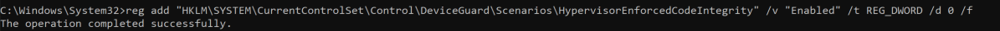

2. **Windows.Registry.HVCI** will return any items in the Hypervisor-protected Code Integrity (HVCI) registry path. An adversary may set the Enabled key to 0 if they intend to manipulate UEFI boot process.

    Open a new collection and run **Exchange.Windows.Registry.HVCI**

    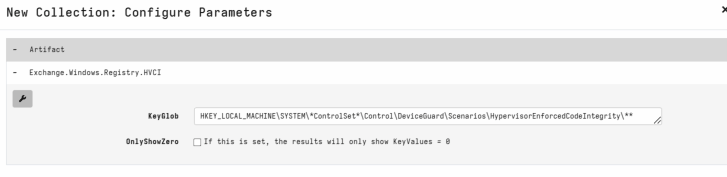

    As you can see results are expected.

    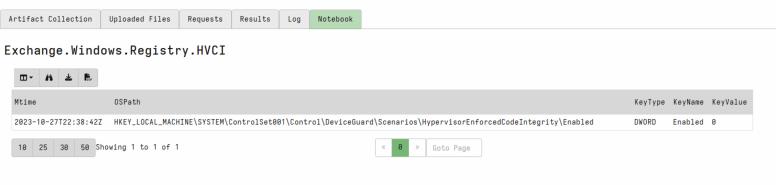

    This artifact can be useful in a stacked hunt or monitoring capacity.


### Event Logs

1. Open the reference Microsoft article: [Guidance for investigating attacks using CVE-2022-21894: The BlackLotus campaign](https://www.microsoft.com/en-us/security/blog/2023/04/11/guidance-for-investigating-attacks-using-cve-2022-21894-the-blacklotus-campaign/)

Review the section on **Event logs entries - t**here are 2 main potential EventLogs of interest:

- *Microsoft-Windows-Windows Defender/Operational EventID: 3002*

    IOCRegex: 0x80070057|error and failed

    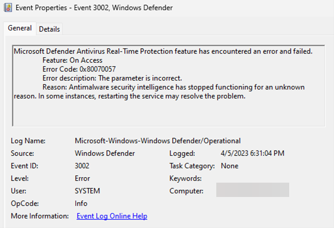


- System event log *EventID: 7023*

    IOCRegex: Defender|Windefend

    Note: I have noticed other System service failures at the same time which may also indicate the malware’s method of disabling, but further research is required.

    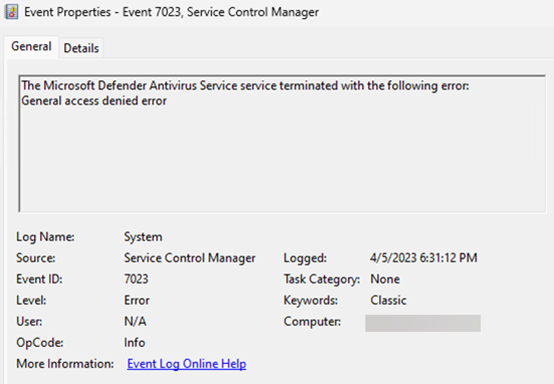


1. Run a collection for **Windows.EventLogs.EvtxHunter** targeting the details above:

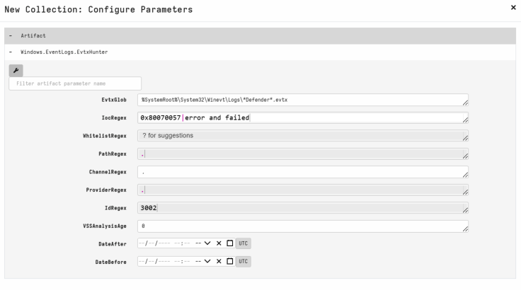

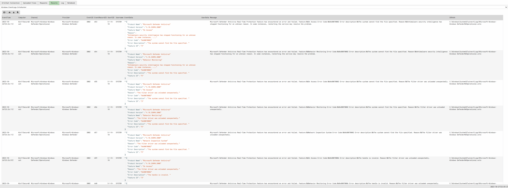

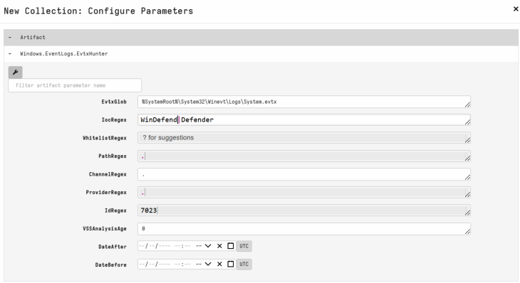

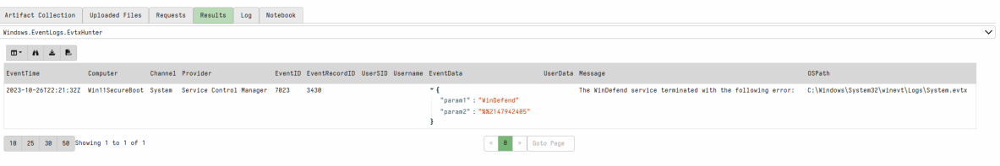

### References:

1. [ESET, Martin Smolar - BlackLotus UEFI bootkit: Myth confirmed](https://www.welivesecurity.com/2023/03/01/blacklotus-uefi-bootkit-myth-confirmed/)
2. [Microsoft Incident Response - Guidance for investigating attacks using CVE-2022-21894: The BlackLotus campaign](https://www.microsoft.com/en-us/security/blog/2023/04/11/guidance-for-investigating-attacks-using-cve-2022-21894-the-blacklotus-campaign/)
3. [James Bottomley  - The Meaning of all the UEFI Keys](https://blog.hansenpartnership.com/the-meaning-of-all-the-uefi-keys/)
4. [Microsoft - Enable virtualization-based protection of code integrity](https://learn.microsoft.com/en-us/windows/security/hardware-security/enable-virtualization-based-protection-of-code-integrity)
5. [How to enable TPM and Secure Boot on VMware to install Windows 11](https://pureinfotech.com/enable-tpm-secure-boot-vmware-install-windows-11/)
6. [Adam Paulina - Running Malware Below the OS – The State of UEFI Firmware Exploitation](https://www.binarydefense.com/resources/blog/running-malware-below-the-os-the-state-of-uefi-firmware-exploitation/)

👈 To go back, tap the link at the top left, or swipe from left to right across your screen.
