## **Objective**

This lab is an introduction to help understand how Velociraptor can access data.

GUI mode will be used throughout the workshop. We will be using VQL plugins and running queries against various accessors to compare the results.

This is a fairly long lab best suited to newer users, feel free to skip a head if you have good understanding of VQL and how it can interact with Windows systems.

## **Dependencies**

Velociraptor available on the desktop to run as per [Lab: GUI mode walk through](/projects/deathcon2023-practical-death-by-velociraptor/gui-mode/)

Open cmd, browse to desktop and run: `velociraptor .exe gui --datastore=./VRdata -v`

The Velociraptor GUI is configured to open automatically upon start, but the credentials are available below:

- URL: [`https://127.0.0.1:8889/`](https://127.0.0.1:8889/)
- Username: `admin`
- Password: `password`

## Tasks

### **Setup working notebook**

1. In your Velociraptor GUI, on the left hand side menu, click `Notebooks`

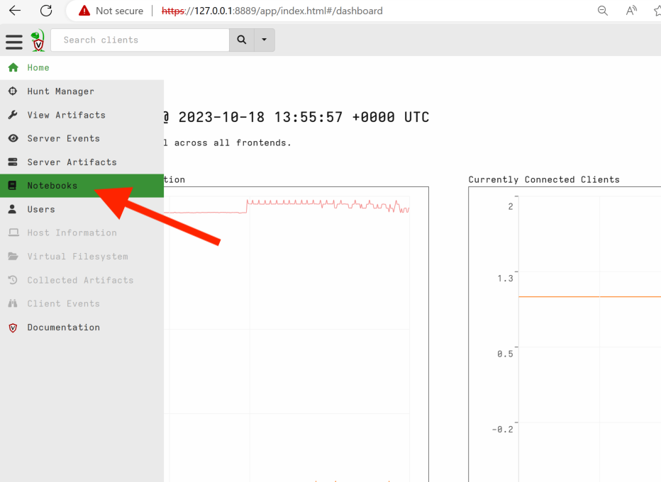

1. Create a new notebook

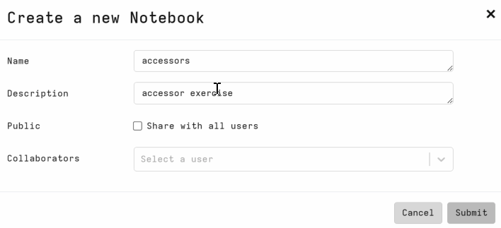

1. Typically we can add a VQL cell or markdown for presentation.

    In this case we select newly created notebook > Add Cell (+)  > new VQL cell


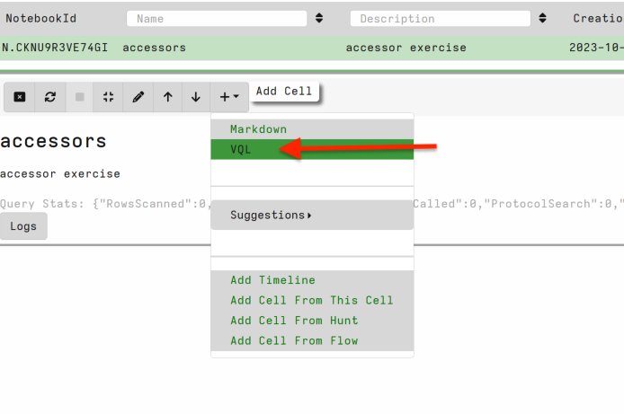

1. Use the up and down arrows to position your VQL cell

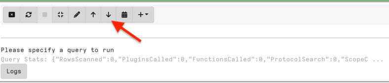

One of the best features about GUI mode is the VQL suggestion feature. When running VQL in a notebook: use the suggestion feature by typing `?` then any string of interest. You can also use this feature to question (with ?) available arguments for any plugin or function.

plugin:

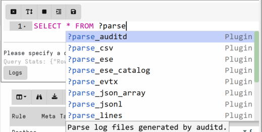

function:

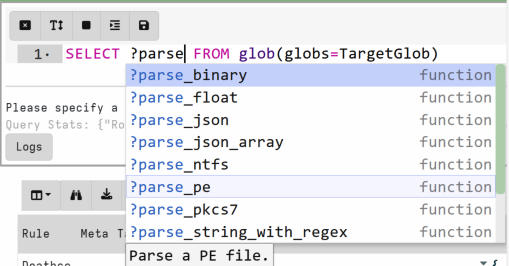

arguments:

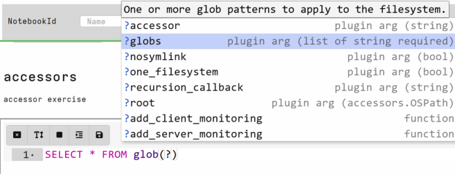

### Disk

The glob() plugin is one of the most widely used plugins in Velociraptor. It has the capability to hit many types of data and great to test with to learn about how you can interact with data in Velociraptor.

> 💡 Some notes on glob
>
> - Both / or \ can be path separators
> - * is a wildcard (e.g. *.exe matches all files ending with .exe)
> - OR is expressed as comma separated strings in {} e.g. C:\Users\Public\*.{exe,dll,sys} is any exe or dll in the Public folder.
> - ** is a recursive search. e.g. C:\Users\**\.exe

1. Query the Velociraptor exe on disk

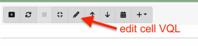

Paste below vql:

```sql
LET TargetGlob='''C:\Users\*\Desktop\Velociraptor*'''
SELECT * FROM glob(globs=TargetGlob)
```

NOTE: TargetGlob is using multiple ‘ else we would need to escape the backslashes in a notebook.

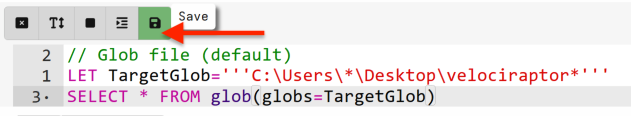

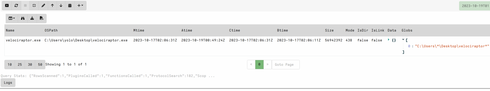

1. Query the Velociraptor exe on disk with ntfs access to the above query.

As we have downloaded the velociraptor binary - we expect to see a Zone.Identifier alternate data stream.

```sql
LET TargetGlob='''C:\Users\*\Desktop\Velociraptor*''' 
SELECT * FROM glob(accessor='ntfs', globs=TargetGlob)
```

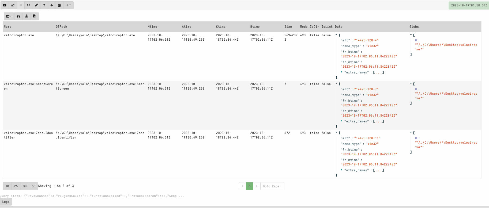

NOTE: if you have obtained the Velociraptor binary in a different way, please modify GlobTarget to target your user’s Downloads folder. `C:\Users\*\Downloads\*`

Compare other locations. `C:\*` is another good comparison to see ntfs special files

1. Leverage the mft accessor to view the Zone.Identifier.

Velociraptor’s power comes from the ability to manipulate data and execute enrichment as desired whilst accessing use cases that may otherwise be difficult. In this case we are only interested in the Zone.Identifier so we want to add a filter. We also want to view the Zone.Identifer data .

```sql
LET TargetGlob='''C:\Users\*\Desktop\Velociraptor*'''
SELECT OSPath,Mtime,Btime,Size,
    Data.mft as Inode,
    read_file(accessor='mft',filename=OSPath[0] + Data.mft) as ADS
FROM glob(accessor='ntfs', globs=TargetGlob)
WHERE OSPath =~ 'Zone\.Identifier$'
```

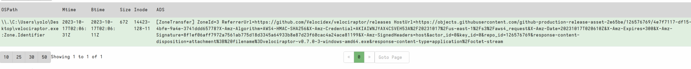

1. Finally we can extract fields of interest from the ADS field using a regex function. Modify your VQL to add the function below.

```sql
parse_string_with_regex(string=ADS,
    regex=[
        'ZoneId=(?P<ZoneId>\\d+)\\r\\n',
        'ReferrerUrl=(?P<ReferrerUrl>.+)\\r\\n',
        'HostUrl=(?P<HostUrl>.+)\\r\\n',
    ]) as ADS
```

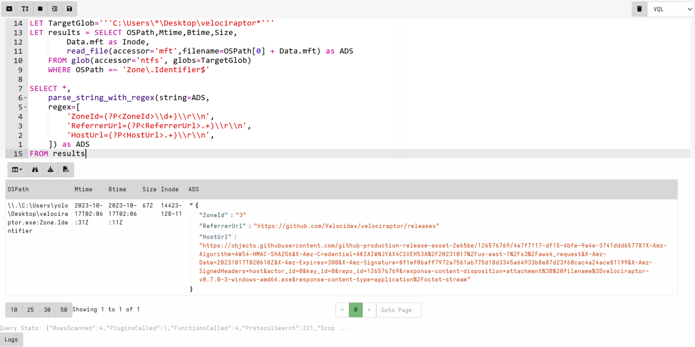

1. When creating content its often easier to find artifacts similar to your desired use case.

Search for Zone.Identifier in the artifacts view.

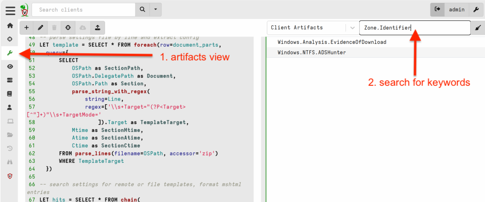

Generally, in client/server setup a system notebook would run queries against the server and we would need to specifically run a collect_client() to tell the server to ask the client to run a collection. In GUI mode the server is the local machine so we can call an artifact in a notebook directly to test content / run analysis easily.

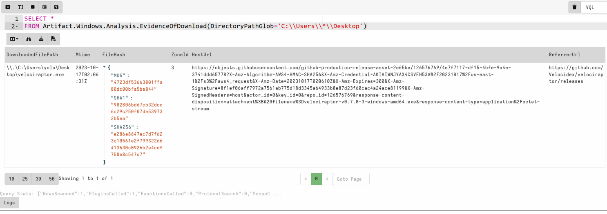

> 💡 Other good sources of finding content are the [Velociraptor Artifact Exchange](https://docs.velociraptor.app/exchange/) and searching the [artifact reference documentation](https://docs.velociraptor.app/artifact_references/).

### Registry

> 💡 Notes on registry accessor
>
> - Uses the OS API to access the registry
> - Top level consists of the major hives (`HKEY_USERS` etc)
> - Values appear as files, Keys appear as directories
> - Default value is named “@”
> - Value content is included inside the Data attribute
> - Can escape components with / using quotes
>
>     `"HKLM\Microsoft\Windows\"http://www.microsoft.com/"`
>
> - The `OSPath` column includes the key (as directory) and the value (as a filename) in the path.
> - The Registry accessor also includes value contents if they are small enough in the `Data` column.

1. First, create a run key by running the command below at a command prompt:

```bash
REG ADD "HKCU\SOFTWARE\Microsoft\Windows\CurrentVersion\Run" /v VRNotepad /t REG_SZ /d "C:\Windows\notepad.exe"
```

1. Run the following VQL in your notebook to query the WIndows API for the key we added:

```sql
LET TargetGlob = '''HKCU\SOFTWARE\Microsoft\Windows\CurrentVersion\Run\*'''
SELECT 
    OSPath, Name, Mtime, 
    Data.type as Type, 
    Data.value AS Value
FROM glob(globs=TargetGlob, accessor="registry")
```

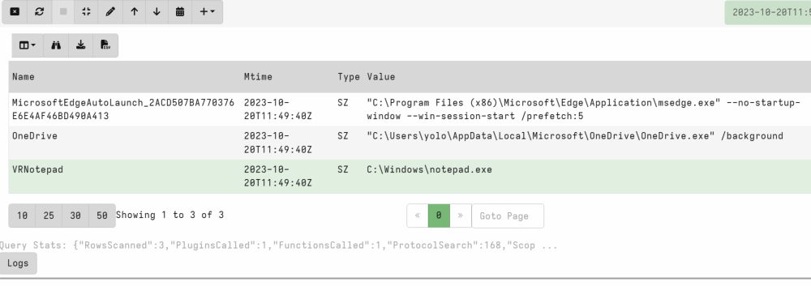

> 💡 When running registry collections with the Windows API many people dont consider the issue of unmounted keys. The above is querying Current User but what if we want to query all users or an unmounted hive?
>
> The raw_registry accessor enables this use case.

1. A simplified version of raw registry query targeting the local user.

```sql
LET TargetGlob = '''SOFTWARE\Microsoft\Windows\CurrentVersion\Run\*'''
LET ntuserpath = environ(var='HOMEDRIVE') + environ(var='HOMEPATH') + '\\ntuser.dat'

SELECT OSPath,Mtime,
    Name as KeyName,
    Data.type as KeyType,
    Data.value as KeyValue
FROM glob(  globs=TargetGlob,
            accessor="raw_reg",
            root=pathspec(
                DelegateAccessor="ntfs",
                DelegatePath=ntuserpath,
                Path="/"))
```

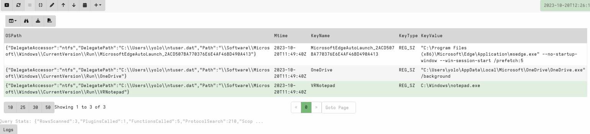

1. Review artifact: **Windows.Registry.NTUser.**

Observe how it combines accessors. It collects user hive paths, uses the ntfs and raw_registry accessor to parse a registry key glob.

Try to run **Windows.Registry.NTUser** `SOFTWARE\Microsoft\Windows\CurrentVersion\Run\*`

### Process

> 💡 What is a Process?
>
> - A process is a user space task with a specific virtual memory layout
> - A process has a Process ID (Pid), an initial binary on disk, an ACL Token, environment variables etc.
> - The process links binaries like .dll or .exe which can contain metadata such as signatures.
> - The process contains working memory which might contain additional data
> - Each of these properties can be inspected by Velociraptor

Velociraptor enables access to this data through the use of plugins and functions.

1. Search for Process orientated artifacts: `Pslist|dlls|process|memory`

    The Velociraptor search takes regex and searches accross Artifact name and description paragraph. You can see some non process artifacts return in results (this is expected).


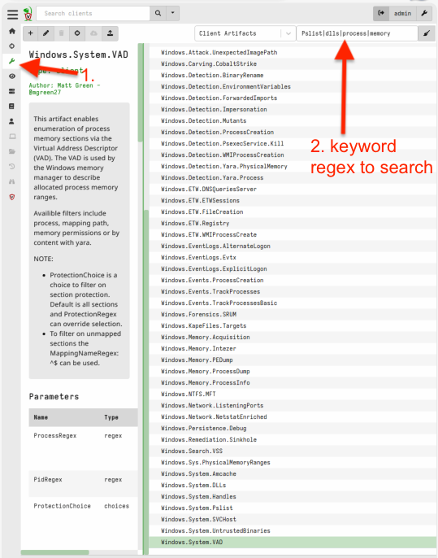

Take a minute to review and ensure to check **Windows.System.Pslist**. This artifact uses the pslist() plugin which is the cornerstone of obtaining process data for additional use cases.

1. Run notepad.exe and type any string - e.g DEATHcon rocks!

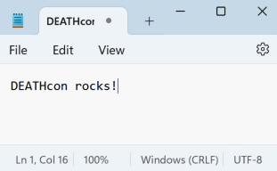

1. In a new Velociraptor notebook cell add in:

```sql
SELECT *
FROM pslist()
WHERE Name =~ 'notepad'
```

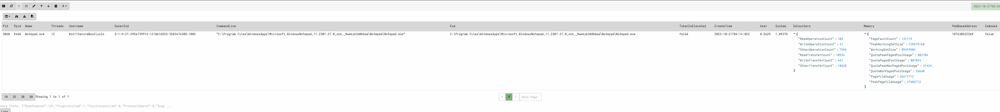

1. Generally the Pid is the main metadata we need to leverage further process enrichment.

    Add in the token() function to add additional process user context.

    ```sql
    SELECT Pid, Name,Exe,CommandLine, Username,
        token(pid=Pid) as TokenInfo
    FROM pslist()
    WHERE Name =~ 'notepad'
    ```

    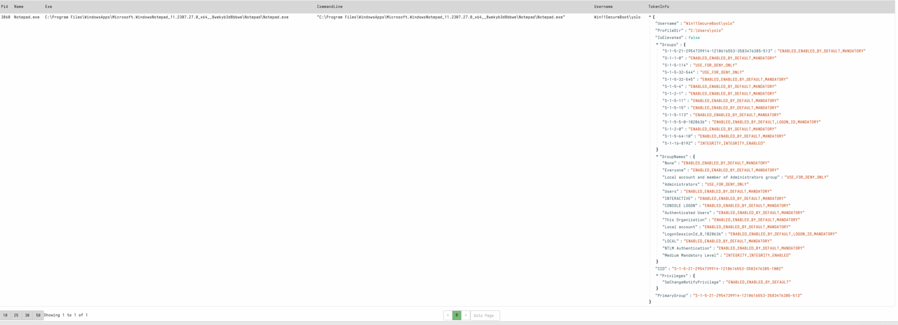

    1. We can take a selection of processes and run yara over them. Replace the string you ran in notepad inside the yara below.

    ```sql
    LET YaraRule = '''rule DEATHconString {
       strings:
         $str = "DEATHcon rocks!" wide
        condition:
          any of them
    }'''
    
    LET target_processes = SELECT Pid, Name,Exe,CommandLine, Username,
            token(pid=Pid) as TokenInfo
        FROM pslist()
        WHERE Name =~ 'notepad'
    
    SELECT * FROM foreach(row=target_processes,
        query={ 
            SELECT Pid, Name,Exe,CommandLine, TokenInfo, 
                Rule, Meta, Tags, String
            FROM yara(accessor='process',files=str(str=Pid),rules=YaraRule)
        })
    ```

    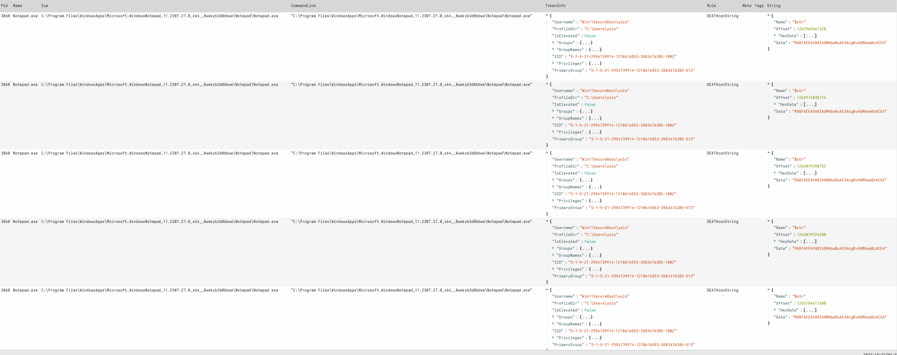

    Velociraptor is simply running yara over the process bytes. You can see multiple hits, accross several offsets. The notepad above was in UTF8 encoding so we would expect a wide yara rule to hit.

    Try running with no process name filter, adding in hit context and hit limits for better understanding how the yara plugin works. **Windows.Detection.Yara.Process** is a production ready artifact for this malware hunting use case!

    > 💡 Velociraptor does have some OS enforced limitations when accessing processes. A good example is system protected processes, in which velociraptor may not be able to access to extract additional data.

    Next we are going to work through my favourite Velociraptor memory use case - the vad() plugin.

    > 💡 VAD plugin
    >
    > - Shows process memory sections via the Virtual Address Descriptor (VAD).
    > - The VAD is used by the Windows memory manager to describe allocated process memory ranges.
    > - This plugin shows all the process memory regions, if the memory is mapped to file and where the filename it is mapped from etc.
    > - The plugin also shows memory region permissions.
    > - This capability enables us to use this metadata to access and query individual memory sections.

    1. Run the yara use case above targeting individual sections using the vad plugin.

        In this case we know we are not looking for mapped files so we can ignore commonly mapped file types by notepad:exe, dll, drv (yes - notepad maps print drivers!).


    ```sql
    LET YaraRule = '''rule DEATHconString {
       strings:
         $str = "DEATHcon rocks!" wide
        condition:
          any of them
    }'''
    
    LET target_processes = SELECT 
            dict(
                Pid=Pid,
                ProcessName=Name,
                Exe=Exe,
                CommandLine=CommandLine,
                TokenInfo=token(pid=Pid)
            ) as ProcessInfo
        FROM pslist()
        WHERE Name =~ 'notepad'
    
    LET target_sections = SELECT *,
            pathspec( 
                DelegateAccessor="process",
                DelegatePath=ProcessInfo.Pid,
                Path=SectionInfo.Address
            ) AS _PathSpec
        FROM foreach(row=target_processes,
            query={ 
                SELECT 
                    dict(
                        Address=Address,
                        Size=Size,
                        MappingName=MappingName,
                        State=State,
                        Type=Type,
                        Protection=Protection,
                        ProtectionMsg=ProtectionMsg,
                        ProtectionRaw=ProtectionRaw
                    ) as SectionInfo,
                    ProcessInfo
                FROM vad(pid=ProcessInfo.Pid)
                WHERE NOT MappingName=~ '\.(dll|drv|exe)$'
            })
    
    SELECT * FROM foreach(row=target_sections,
        query={ 
            SELECT Rule, Meta, Tags, String, SectionInfo,ProcessInfo
            FROM yara(accessor='offset',files=_PathSpec,end=SectionInfo.Size,rules=YaraRule)
        })
    ```

    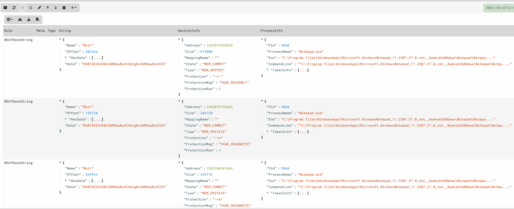

    As the VAD plugin shows the offset and size, we can also query the section easily if we can reference it.

    > 💡 Creating a PathSpec object for easy reference to a processes section in future.
    >
    > - DeligateAccessor = Process,
    > - DelegatePath = ProcessInfo.Pid
    > - Path = SectionInfo.Offset
    > - SectionInfo.Size can be used in the relevant plugin / function if needed

    In this example I have targeted the yara plugin, but we could also use a similar ‘offset’ accessor to upload a file, or easily use other features like the binary_parser.

    1. Open up a new Powershell prompt and run:

        `Invoke-WebRequest -Uri "https://www.google.com" -UseBasicParsing`

        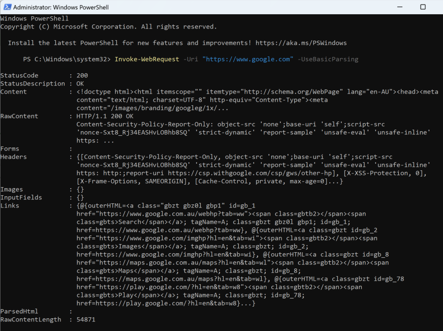

        Powershell will dynamically load DLLs required to access the internet and pull down the google site. For this example we are interested in the **winhttp.dll** and the **WinHttp** APIs.

        Typically we may want to dump or even scan loaded libraries. Vad plugin gives us some nice capabilities to process this data.

        1. Use the VAD plugin to find libraries that have loaded **WinHttp** APIs.

            I have grouped ProcessInfo for ease of viewing.


        ```sql
        LET target_processes = SELECT 
                dict(
                    Pid=Pid,
                    ProcessName=Name,
                    Exe=Exe,
                    CommandLine=CommandLine,
                    TokenInfo=token(pid=Pid)
                ) as ProcessInfo
            FROM pslist()
            WHERE Name =~ 'powershell'
        
        SELECT *,
            FROM foreach(row=target_processes,
                query={ 
                    SELECT *,
                        parse_pe(accessor="process",
                            base_offset=Address, file=str(str=ProcessInfo.Pid)
                        ) AS PEInfo,
                        ProcessInfo
                    FROM vad(pid=ProcessInfo.Pid)
                    WHERE MappingName =~ "dll$"
                        AND PEInfo.Exports =~ "WinHttp"
                    
                })
        ```

        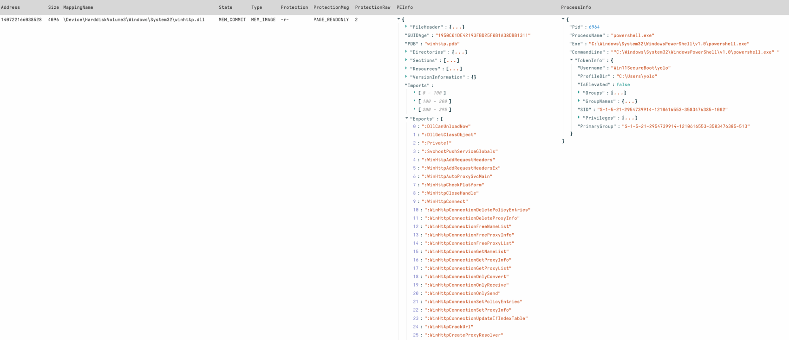

        Hopefully you have an extended appreciation of potential Process based collections and data enrichment we can run in Velociraptor. For bonus points, run parse_pe against the file on disk and compare the results.

        1. Try to run **Windows.System.VAD** - this artifact is a production ready capability of the steps above.


The above is an introduction to Velociraptor accessors and not a complete overview of all available use cases. Please continue in further labs for some more interesting examples.

👈 To go back, tap the link at the top left, or swipe from left to right across your screen.
