## **Objective**

This lab is an introduction to look at Velociraptor performance when using yara.

We will be walking through the best way to run Velociraptor queries with a few different use cases.

## **Dependencies**

Velociraptor available on the desktop to run as per [Lab: GUI mode walk through](/projects/deathcon2023-practical-death-by-velociraptor/gui-mode/)

Open cmd, browse to desktop and run: `velociraptor .exe gui –-datastore=./VRdata -v`

The Velociraptor GUI is configured to open automatically upon start, but the credentials are available below:

- URL: [`https://127.0.0.1:8889/`](https://127.0.0.1:8889/)
- Username: `admin`
- Password: `password`

## Tasks

### Disk queries

Often we have a choice between using a Windows API (glob) or NTFS (glob & parse_mft) based search when hunting on Windows systems.

Due to manually parsing the MFT, NTFS searches generally have better reliability but is often slower as the MFT only stores the top level object (file or folder) and paths need to be reconstructed as the search takes place.

This means:

- Although typically slower, searching for only a specific file name or folder name using NTFS.MFT is better than relying on a path.
- When there is knowledge of the target path, using a glob can be significantly faster.
- Blind searches with knowledge of file attributes like file size can also yield significant performance improvements when scanning at large scale.
- Even though yara has performance optimisation we can deploy in rules (such as header, file size etc), we should always  look at filtering in VQL itself to optimise performance as much as possible for best results.
- Always think of row reduction as a priority before any kind of processing or enrichment when many rows are possible!

    e.g:

    - yara
    - hash
    - parse_pe
    - authenticode

    There might not be a large difference on a small test system, production can scale things up significantly.


1. Firstly we want to add some generated data. We are going to show hunting for web logs.

    Run the following Powershell to import some IIS logs.

    ```powershell
    # DEATHcon 2023: Velociraptor Performance scenario disk datagen
    
    $ZipUrl = "https://github.com/mgreen27/mgreen27.github.io/raw/master/static/other/DEATHcon/inetpub.zip"
    $ZipPath = $env:HOMEDRIVE + $env:HOMEPATH + "\" + ([uri]$ZipUrl).Segments[-1]
    $RandomAppPath = $env:HOMEDRIVE + $env:HOMEPATH + "/SomeRandomAppLocation"
    
    Remove-Item $RandomAppPath -Recurse -Force -ErrorAction Ignore
    Remove-Item "$env:HOMEDRIVE/inetpub" -Recurse -Force -ErrorAction Ignore
    
    Invoke-WebRequest -Uri $ZipUrl -OutFile $ZipPath
    Expand-Archive $ZipPath -DestinationPath "$env:HOMEDRIVE\" -Force
    New-Item -ItemType Directory -Force -Path $RandomAppPath | Out-Null
    Expand-Archive $ZipPath -DestinationPath $RandomAppPath -Force
    
    Get-ChildItem $RandomAppPath,"$env:HOMEDRIVE/inetpub" -Recurse -Filter *.log | Select-Object LastWriteTime,FullName | Format-Table
    ```

    The powershell will download some ws_ftp exploited logs and extract them to default inetpub on C:\ as well as an unexpected path.

    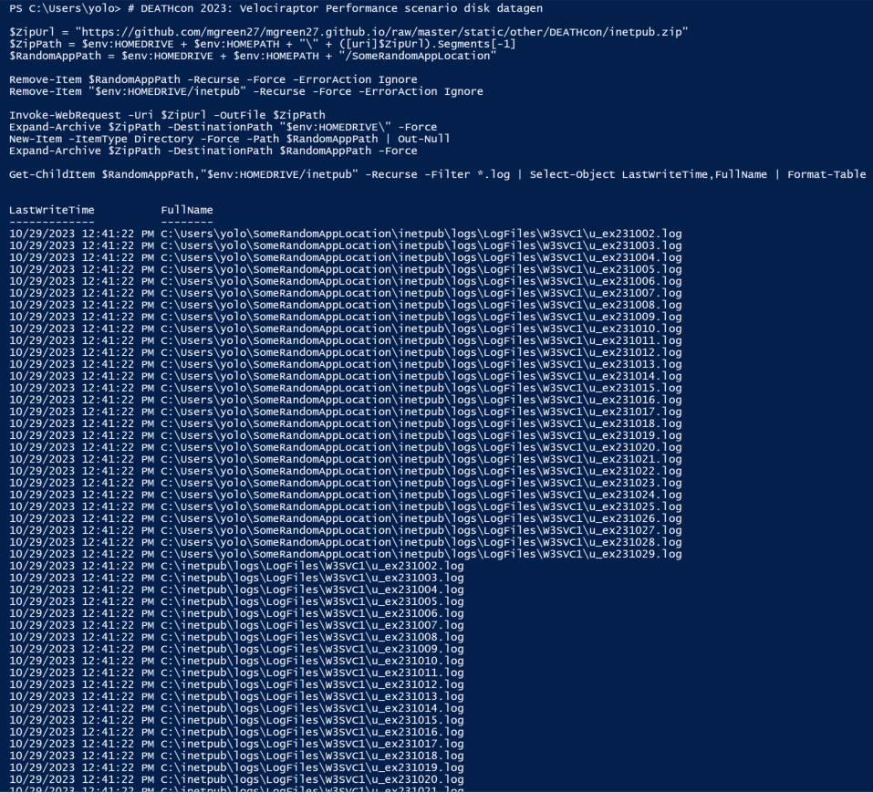

    Typically we would want to write a detection that is not hard coded with folder path (unless scope was very specific).

2. Open your test machine collection view and run a new **Windows.Detection.Yara.NTFS** collection use the MFT to hunt for our test files.

    We will be using the yara:

    ```
    rule LOG_ws_ftp_exploit {
    	meta:
    		description = "Detects potential exploitation of Progress Software WS_FTP Server in IIS logs"
    		reference = "[https://www.rapid7.com/blog/post/2023/09/29/etr-critical-vulnerabilities-in-ws_ftp-server/](https://www.rapid7.com/blog/post/2023/09/29/etr-critical-vulnerabilities-in-ws_ftp-server/)"
    	strings:
    		$post = /\n.{1,50} POST \/AHT\/.{1,250}\n/
    	condition:
    		any of them
    }
    ```

    This Yara rule is written with the goal to return full log line. Using regex with a variable length and could be considered less efficient. We make it efficient by specifically targeting and reducing the number of files we need to scan and using the `NumberOfHits` parameter to stop after a single hit.

    Firstly using the FileRegex for optimisation and adding PathRegex for further targeting of the returned paths:

    `FileNameRegex=^u_.+\.log$`

    `PathRegex=inetpub`

    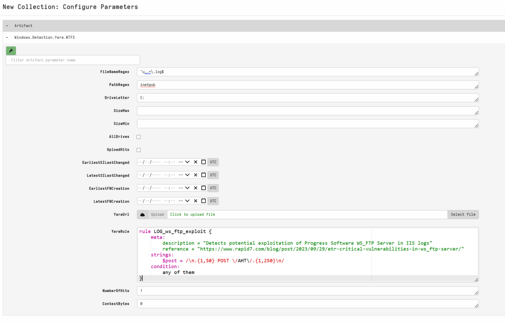

    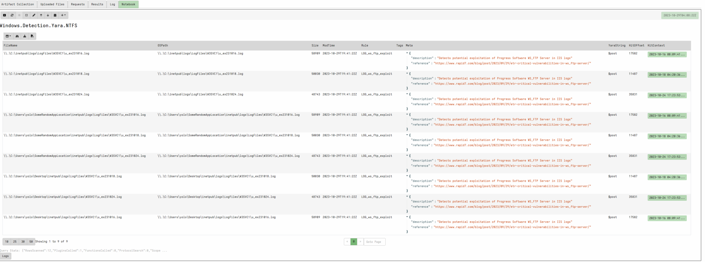

    9 hits ~ 30 seconds

    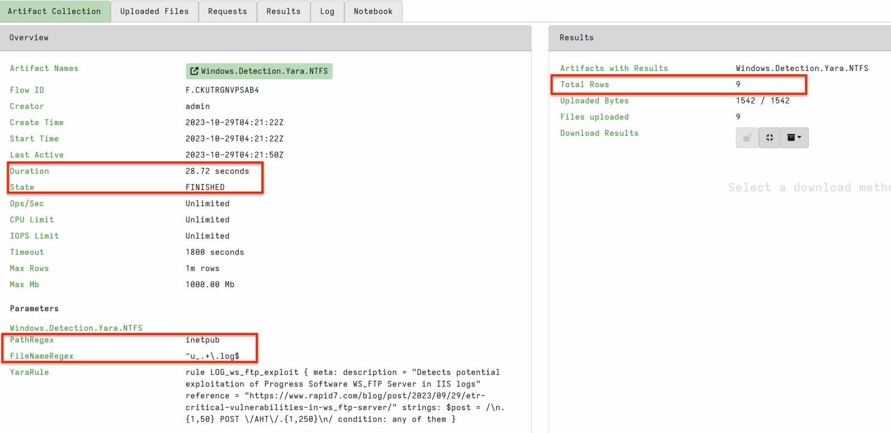

    vs running the same query with a PathRegex filter only.

    `FileNameRegex=.`

    `PathRegex=inetpub\\.+\\u_.+\.log$`

    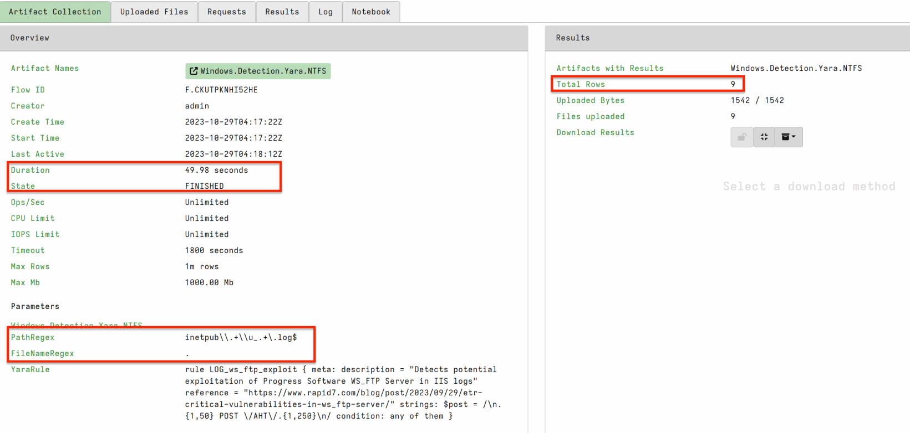

    Although only a small difference in my example at 45seconds, in a production query across large hard disks and busy machines this difference may be significant.

3. Try the same hunt above but using a **Generic.Detection.Yara.Glob** instead

    `PathGlob=C:\**\inetpub\**\u_*.log`


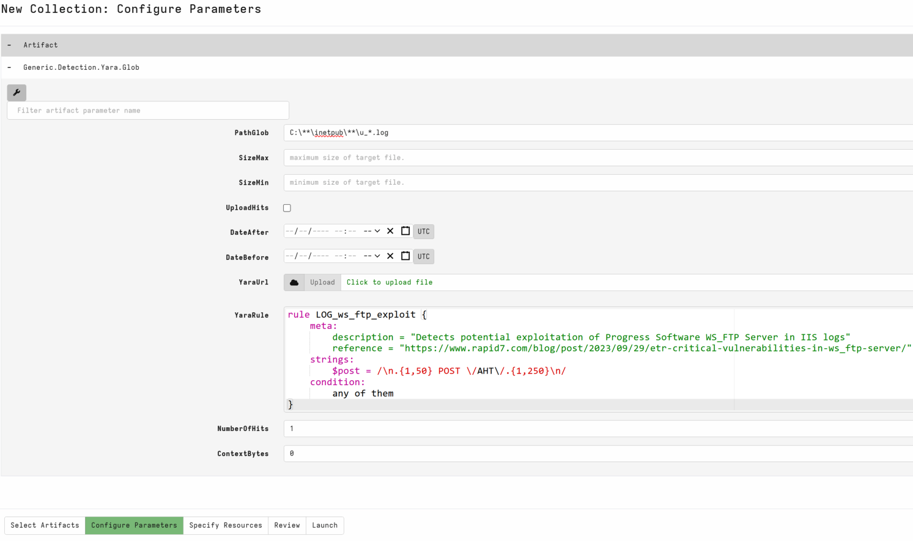

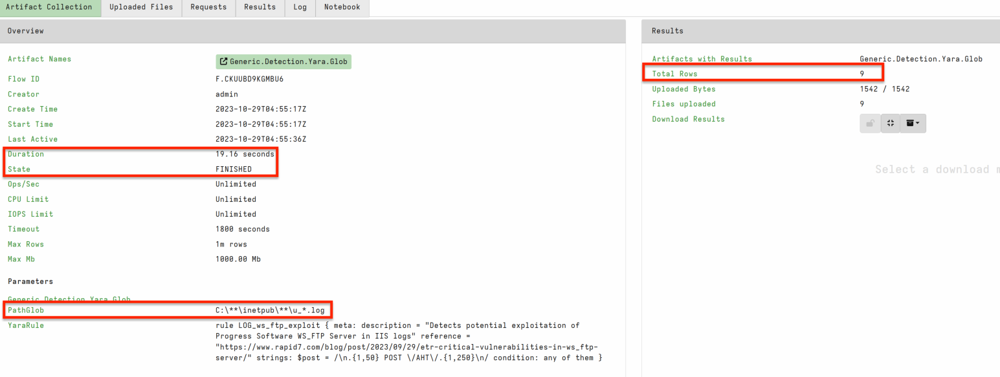

19 seconds is a significant improvement if you do not need ntfs assurance!

However, the fastest was **Generic.Detection.Yara.Glob** knowing the path and using a glob reducing the need to search down many root folders.

`PathGlob=C:\{Users\*\SomeRandomAppLocation\,}inetpub\**\u_*.log`

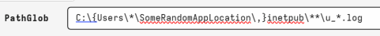

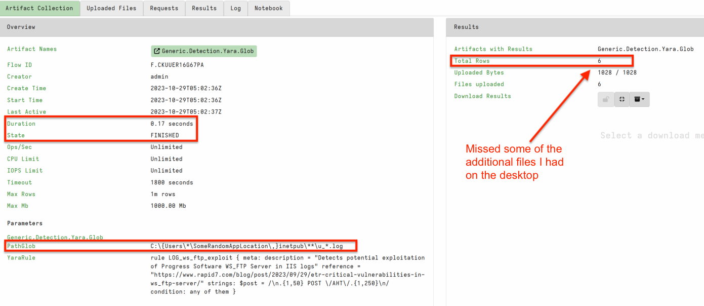

### Memory queries

Similar to disk yara; targeted memory yara is significantly much faster.

I like to use it as detection for well known samples and part of a triage process, and to be confident in weeding out potential false positives.

The obvious downside is less loose yara rules mean potential for a miss if your incorrect.

1. Run the below in Powershell.

    This code will download a Velocidex loader tool and inject a benign Cobalt Strike beacon into notepad.

    ```powershell
    # DEATHcon 2023: Velociraptor injection datagen
    $loader_url = "https://github.com/Velocidex/injector/releases/download/v0.1/loader.exe"
    $payload_path = $env:HOMEDRIVE + $env:HOMEPATH + "\Desktop\loader.exe"
    
    # Defender exclusions
    Add-MpPreference -ExclusionPath $payload_path -ExclusionProcess $payload_path -ExclusionExtension "exe,dll,efi,ps1"
    
    Invoke-WebRequest -Uri $loader_url -OutFile $payload_path
    Start-Process -WindowStyle hidden -FilePath notepad.exe
    Start-Sleep -Seconds 2
    $target_pid = (Get-Process Notepad)[0].id
    cmd /c "$payload_path $target_pid"
    ```

    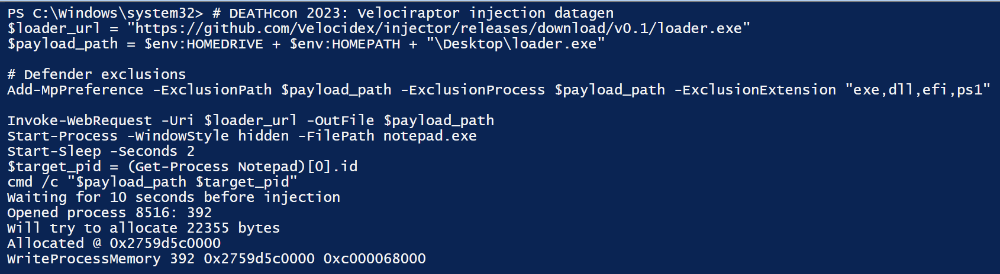

    After execution there should be a hidden notepad.exe running with an injected Cobalt Strike

2. Open your test machine collection view and run a new **Windows.Detection.Yara.Process** collection use the MFT to hunt for our test files.

    The default yara rule is CobaltStrike so we can just hit launch to run the collection.


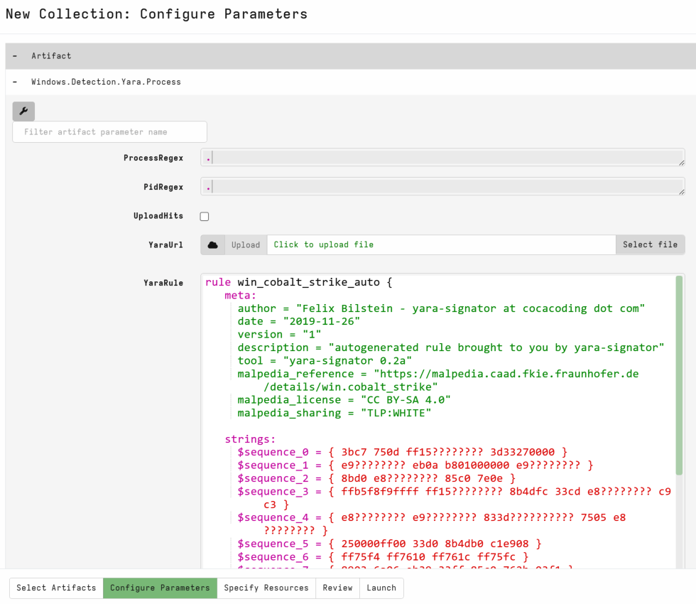

You can see the hit is directly on notepad, taking ~130 seconds.

Most Velociraptor Yara artifacts are configured to stop after one hit for optimal performance.

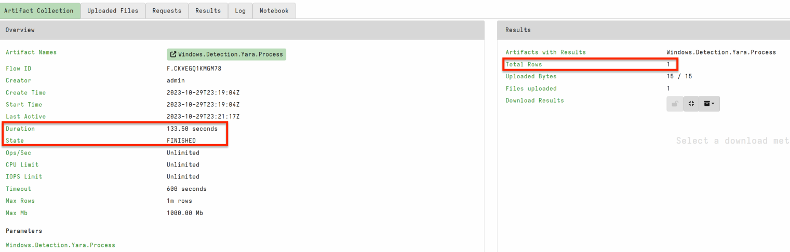

1. Next, I want to show you an optimal way to improve detections with data reduction prior to Yara. Windows.System.VAD artifact we discussed previously enables running Yara over individual sections with memory attribute targeting.

    Open your test machine collection view and run a new **Windows.System.VAD** collection we want to copy the yara run in the previous artifact. I usually reselect the Yara.Process and copy out the yara then run **Windows.System.VAD** with the yara rule in my clipboard.

    For this sample I want you to run:

    `MappingRegex = ^$` : Regex for unbacked sections.

    `ProtectionRegex = -rw` : Typical malware would have its injected sections executable but for this demo we are targeting -rw to show some FP triage later on.

    Dont forget to add in the CobaltStrike Yara rule into `SuspiciousContent`!

    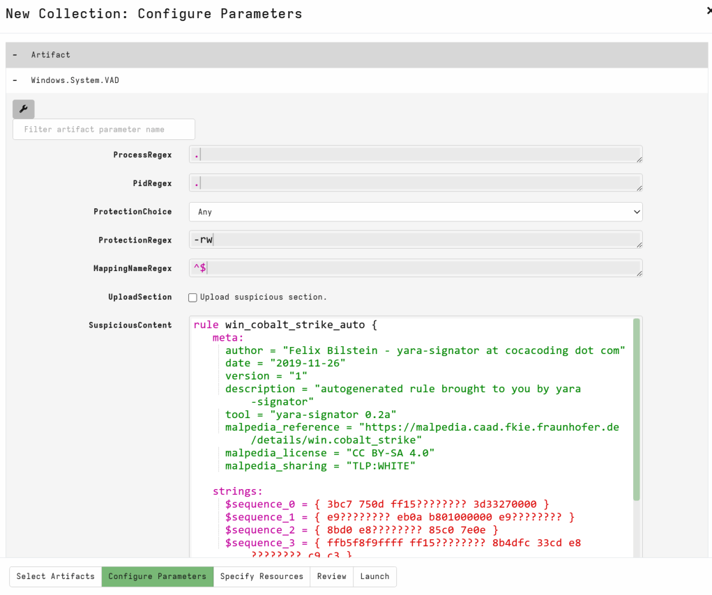


When completed we have several hits and results were returned much faster due to the targeting. Keep in mind, we targeted unbacked with RW protection, unbacked with XRW protection for instance is much less common.

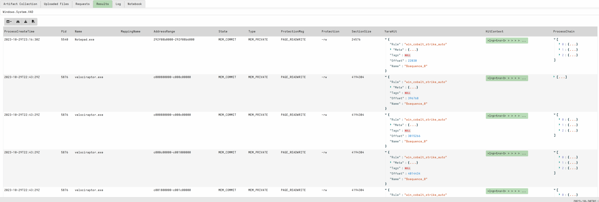

We can see Velociraptor.exe has several hits. **Windows.Detection.Yara.Process** filters out the Velociraptor process by default  **Windows.System.VAD** does not. We can use this as an opportunity to triage hits and show how we rule out a false positive.

> 💡 **Process Yara Triage**
>
> In the wild, we regularly see False Positives when running memory yara.
>
> Select the `HitContext` field to view string and hex view of the hit.
>
> Often we can see strings that indicate a security product or why the hit has occurred.

1. Rerun the query above and increase the ContextBytes to 2000. This should show enough context on our hit to determine FPs.

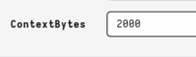

Clicking on the HitContext on our notepad.exe hits we can see suspicious strings.

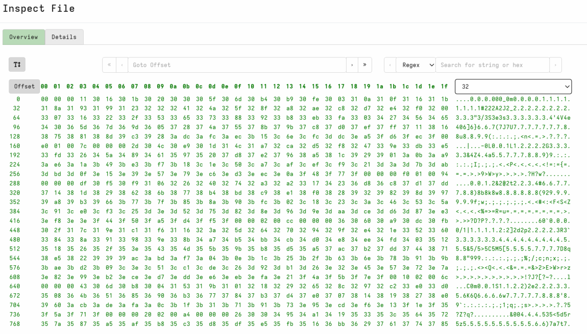

Clicking on the HitContext on our velociraptor.exe hits we can see clearly VQL and our yara rule, indicating we are likely looking at a false positive.

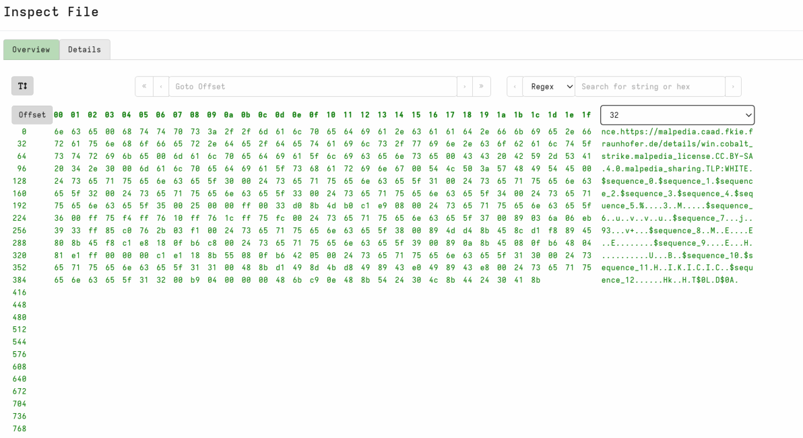

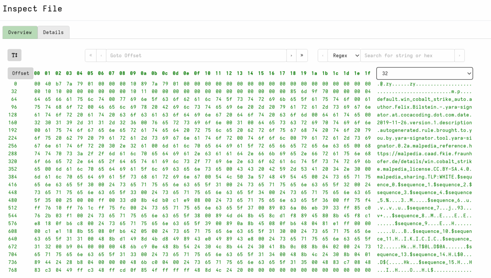

### References:

1. [Neo23x0 - YARA-Performance-Guidelines](https://github.com/Neo23x0/YARA-Performance-Guidelines)
2. [Hexacorn - Writing better Yara rules in 2023…](https://www.hexacorn.com/blog/2023/08/26/writing-better-yara-rules-in-2023/)
3. [Yara documentation - Writing rules](https://yara.readthedocs.io/en/stable/writingrules.html)

👈 To go back, tap the link at the top left, or swipe from left to right across your screen.
